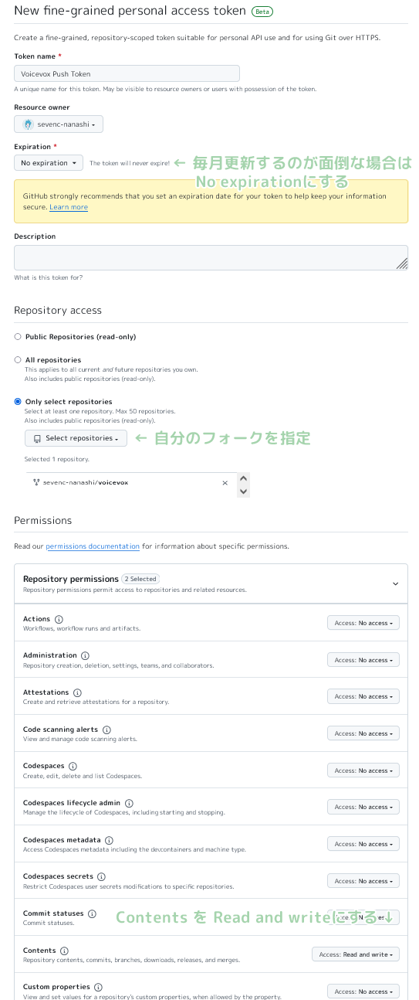

# VOICEVOX

[](https://github.com/VOICEVOX/voicevox/releases)
[](https://github.com/VOICEVOX/voicevox/actions/workflows/build.yml)
[](https://github.com/VOICEVOX/voicevox/actions/workflows/test.yml)
[](https://discord.gg/WMwWetrzuh)

[VOICEVOX](https://voicevox.hiroshiba.jp/) のエディターです。

（エンジンは [VOICEVOX ENGINE](https://github.com/VOICEVOX/voicevox_engine/) 、
コアは [VOICEVOX CORE](https://github.com/VOICEVOX/voicevox_core/) 、
全体構成は [こちら](./docs/全体構成.md) に詳細があります。）

## ユーザーの方へ

こちらは開発用のページになります。利用方法に関しては[VOICEVOX 公式サイト](https://voicevox.hiroshiba.jp/) をご覧ください。

## プロジェクトに貢献したいと考えている方へ

VOICEVOXプロジェクトは興味ある方の参画を歓迎しています。
[貢献手順について説明したガイド](./CONTRIBUTING.md)をご用意しております。

貢献というとプログラム作成と思われがちですが、ドキュメント執筆、テスト生成、改善提案への議論参加など様々な参加方法があります。
初心者歓迎タスクもありますので、皆様のご参加をお待ちしております。

VOICEVOX のエディタは Electron・TypeScript・Vue・Vuex などが活用されており、全体構成がわかりにくくなっています。  
[コードの歩き方](./docs/コードの歩き方.md)で構成を紹介しているので、開発の一助になれば幸いです。

Issue を解決するプルリクエストを作成される際は、別の方と同じ Issue に取り組むことを避けるため、
Issue 側で取り組み始めたことを伝えるか、最初に Draft プルリクエストを作成してください。

[VOICEVOX 非公式 Discord サーバー](https://discord.gg/WMwWetrzuh)にて、開発の議論や雑談を行っています。気軽にご参加ください。

### デザインガイドライン

[UX・UI デザインの方針](./docs/UX・UIデザインの方針.md)をご参照ください。

## 環境構築

[.node-version](.node-version) に記載されているバージョンの Node.js をインストールしてください。  
Node.js の管理ツール（[nvs](https://github.com/jasongin/nvs)や[Volta](https://volta.sh)など）を利用すると簡単にインストールでき、Node.js の自動切り替えもできます。

Node.js をインストール後、[このリポジトリ](https://github.com/VOICEVOX/voicevox.git) を Fork して `git clone` してください。

### 依存ライブラリをインストールする

次のコマンドを実行することで依存ライブラリがインストール・アップデートされます。

```bash
npm i -g pnpm # 初回のみ
pnpm i
```

## 実行

### エンジンの準備

`.env.production`をコピーして`.env`を作成し、`VITE_DEFAULT_ENGINE_INFOS`内の`executionFilePath`に
[製品版 VOICEVOX](https://voicevox.hiroshiba.jp/) 内の`vv-engine/run.exe`を指定すれば動きます。

Windows でインストール先を変更していない場合は`C:/Users/(ユーザー名)/AppData/Local/Programs/VOICEVOX/vv-engine/run.exe`を指定してください。  
パスの区切り文字は`\`ではなく`/`なのでご注意ください。

macOS 向けの`VOICEVOX.app`を利用している場合は`/path/to/VOICEVOX.app/Resources/MacOS/vv-engine/run`を指定してください。

Linux の場合は、[Releases](https://github.com/VOICEVOX/voicevox/releases/)から入手できる tar.gz 版に含まれる`vv-engine/run`コマンドを指定してください。
AppImage 版の場合は`$ /path/to/VOICEVOX.AppImage --appimage-mount`でファイルシステムをマウントできます。

VOICEVOX エディタの実行とは別にエンジン API のサーバを立てている場合は`executionFilePath`を指定する必要はありませんが、
代わりに`executionEnabled`を`false`にしてください。
これは製品版 VOICEVOX を起動している場合もあてはまります。

エンジン API の宛先エンドポイントを変更する場合は`VITE_DEFAULT_ENGINE_INFOS`内の`host`を変更してください。

### Electron の実行

```bash
# 開発しやすい環境で実行
pnpm run electron:serve

# ビルド時に近い環境で実行
pnpm run electron:serve --mode production

# 引数を指定して実行
pnpm run electron:serve -- ...
```

音声合成エンジンのリポジトリはこちらです <https://github.com/VOICEVOX/voicevox_engine>

### Storybook の実行

Storybook を使ってコンポーネントを開発することができます。

```bash
pnpm run storybook
```

main ブランチの Storybook は[VOICEVOX/preview-pages](https://github.com/VOICEVOX/preview-pages)から確認できます。  
<https://voicevox.github.io/preview-pages/preview/branch-main/storybook/index.html>

### ブラウザ版の実行（開発中）

別途音声合成エンジンを起動し、以下を実行して表示された localhost へアクセスします。

```bash
pnpm run browser:serve
```

また、main ブランチのビルド結果が[VOICEVOX/preview-pages](https://github.com/VOICEVOX/preview-pages)にデプロイされています。  
<https://voicevox.github.io/preview-pages/preview/branch-main/editor/index.html>  
今はローカル PC 上で音声合成エンジンを起動する必要があります。

## ビルド

```bash
pnpm run electron:build
```

### Github Actions でビルド

fork したリポジトリで Actions を ON にし、workflow_dispatch で`build.yml`を起動すればビルドできます。
成果物は Release にアップロードされます。

## テスト

### 単体テスト

`./tests/unit/` 以下にあるテストと、Storybookのテストを実行します。

```bash
pnpm run test:unit
pnpm run test-watch:unit # 監視モード
pnpm run test-ui:unit # VitestのUIを表示
pnpm run test:unit --update # スナップショットの更新
```

> [!NOTE]  
> `./tests/unit` 下のテストは、ファイル名によってテストを実行する環境が変化します。
>
> - `.node.spec.ts`：Node.js 環境
> - `.browser.spec.ts`：ブラウザ環境（Chromium）
> - `.spec.ts`：ブラウザ環境（happy-domによるエミュレート）

### ブラウザ End to End テスト

Electron の機能が不要な、UI や音声合成などの End to End テストを実行します。

> [!NOTE]
> 一部のエンジンの設定を書き換えるテストは、CI(Github Actions)上でのみ実行されるようになっています。

```bash
pnpm run test:browser-e2e
pnpm run test-watch:browser-e2e # 監視モード
pnpm run test-watch:browser-e2e --headed # テスト中の UI を表示
pnpm run test-ui:browser-e2e # Playwright の UI を表示
```

Playwright を使用しているためテストパターンを生成することもできます。
**ブラウザ版を起動している状態で**以下のコマンドを実行してください。

```bash
pnpm exec playwright codegen http://localhost:5173/ --viewport-size=1024,630
```

詳細は [Playwright ドキュメントの Test generator](https://playwright.dev/docs/codegen-intro) を参照してください。

### Storybook の Visual Regression Testing

Storybook のコンポーネントのスクリーンショットを比較して、変更がある場合は差分を表示します。

> [!NOTE]
> このテストは Windows でのみ実行できます。

```bash
pnpm run test:storybook-vrt
pnpm run test-watch:storybook-vrt # 監視モード
pnpm run test-ui:storybook-vrt # Playwright の UI を表示
```

#### スクリーンショットの更新

ブラウザ End to End テストと Storybook では Visual Regression Testing を行っています。
現在 VRT テストは Windows のみで行っています。
以下の手順でスクリーンショットを更新できます：

##### Github Actions で更新する場合

1. フォークしたリポジトリの設定で GitHub Actions を有効にします。
2. リポジトリの設定の Actions > General > Workflow permissions で Read and write permissions を選択します。
3. `[update snapshots]` という文字列をコミットメッセージに含めてコミットします。

   ```bash
   git commit -m "UIを変更 [update snapshots]"
   ```

4. Github Workflow が完了すると、更新されたスクリーンショットがコミットされます。
5. プルした後、空コミットをプッシュしてテストを再実行します。

   ```bash
   git commit --allow-empty -m "（テストを再実行）"
   git push
   ```

> [!NOTE]
> トークンを作成して Secrets に追加することで、自動的にテストを再実行できます。
>
> 1. [Fine-granted Tokens](https://github.com/settings/personal-access-tokens/new) にアクセスします。
> 2. 適当な名前を入力し、 `ユーザー名/voicevox` へのアクセス権を与え、 Repository permissions の Contents で Read and write を選択します。
>    <details>
>    <summary>設定例</summary>
>    
>    </details>
> 3. トークンを作成して文字列をコピーします。
> 4. `ユーザー名/voicevox` のリポジトリの Settings > Secrets and variables > Actions > New repository secret を開きます。
> 5. 名前に `PUSH_TOKEN` と入力し、先ほどの文字列を貼り付けて Secrets を追加します。

##### ローカルで更新する場合

ローカル PC の OS に対応したもののみが更新されます。

```bash
pnpm run test:browser-e2e --update-snapshots
```

### Electron End to End テスト

Electron の機能が必要な、エンジン起動・終了などを含めた End to End テストを実行します。

```bash
pnpm run test:electron-e2e
pnpm run test-watch:electron-e2e # 監視モード
```

## 依存ライブラリのライセンス情報の生成

依存ライブラリのライセンス情報は Github Workflow でのビルド時に自動生成されます。以下のコマンドで生成できます。

```bash
# get licenses.json from voicevox_engine as engine_licenses.json

pnpm run license:generate -o voicevox_licenses.json
pnpm run license:merge -o public/licenses.json -i engine_licenses.json -i voicevox_licenses.json
```

## コードフォーマット

コードのフォーマットを整えます。プルリクエストを送る前に実行してください。

```bash
pnpm run fmt
```

## リント（静的解析）

コードの静的解析を行い、バグを未然に防ぎます。プルリクエストを送る前に実行してください。

```bash
pnpm run lint
```

## タイポチェック

[typos](https://github.com/crate-ci/typos) を使ってタイポのチェックを行っています。

```bash
pnpm run typos
```

でタイポチェックを行えます。
もし誤判定やチェックから除外すべきファイルがあれば
[設定ファイルの説明](https://github.com/crate-ci/typos#false-positives) に従って`_typos.toml`を編集してください。

## 型チェック

TypeScript の型チェックを行います。

```bash
pnpm run typecheck
```

## Markdownlint

Markdown の文法チェックを行います。

```bash
pnpm run markdownlint
```

## Shellcheck

ShellScript の文法チェックを行います。
インストール方法は [こちら](https://github.com/koalaman/shellcheck#installing) を参照してください。

```bash
shellcheck ./build/*.sh
```

## OpenAPI generator

音声合成エンジンが起動している状態で以下のコマンドを実行してください。

```bash
curl http://127.0.0.1:50021/openapi.json >openapi.json

pnpm exec openapi-generator-cli generate \
    -i openapi.json \
    -g typescript-fetch \
    -o src/openapi/ \
    --additional-properties "modelPropertyNaming=camelCase,supportsES6=true,withInterfaces=true,typescriptThreePlus=true"

pnpm run fmt
```

### OpanAPI generator のバージョンアップ

新しいバージョンの確認・インストールは次のコマンドで行えます。

```bash
pnpm exec openapi-generator-cli version-manager list
```

## VS Code でのデバッグ実行

npm scripts の `serve` や `electron:serve` などの開発ビルド下では、ビルドに使用している vite で sourcemap を出力するため、ソースコードと出力されたコードの対応付けが行われます。

`.vscode/launch.template.json` をコピーして `.vscode/launch.json` を、
`.vscode/tasks.template.json` をコピーして `.vscode/tasks.json` を作成することで、
開発ビルドを VS Code から実行し、デバッグを可能にするタスクが有効になります。

## ライセンス

LGPL v3 と、ソースコードの公開が不要な別ライセンスのデュアルライセンスです。
別ライセンスを取得したい場合は、ヒホに求めてください。  
X アカウント: [@hiho_karuta](https://x.com/hiho_karuta)
