# VOICEVOXの使い方 0.5.1 版

## はじめに
これは[ヒホ](https://twitter.com/hiho_karuta)が開発したテキスト音声合成ソフトウェア「VOICEVOX」の使い方を紹介するドキュメントです。

最初に、インストール（もしくはZipファイルを解凍）したディレクトリの中にあるソフトウェアの利用規約（README_SOFTWARE.txt）と音声ライブラリの利用規約（README_LIBRARY.txt）をご確認ください。

[使い方を軽めに紹介した動画](https://youtu.be/4yVpklclxwU)もあるので、よかったらご覧ください。

## 利用規約
ソフトウェアを起動して、右上の「ヘルプ」から、ソフトウェアの利用規約と、音声ライブラリの利用規約をご確認ください。

## 起動方法
起動しようとすると「WindowsによってPCが保護されました」というダイアログが表示されるかもしれません。その際は「詳細情報」をクリックし、「実行」を選んでください。

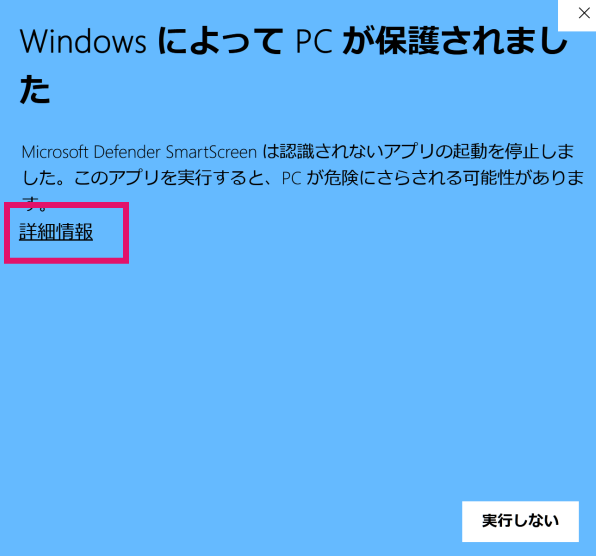  
↓  
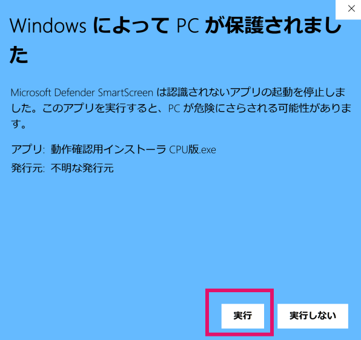

## 音声合成エンジンの起動
最初に音声合成エンジンが起動します。１０秒ほど時間がかかると思います。メモリが3GB以上のNVIDIA製GPUをお持ちの方はぜひGPUモードで起動します。GPUモードの方が音声の生成がずっと早くて快適です。

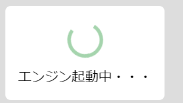

## 音声の生成
キャラクターアイコンの右にある空白をクリックしてテキストを入力してみてください。

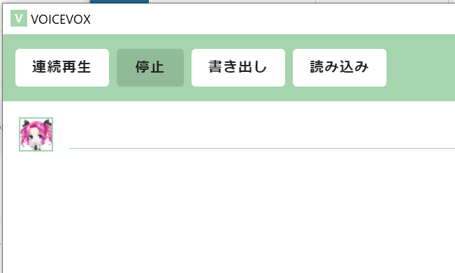

エンターボタンを押して文章を確定すると、画面の下の方に読みとアクセントが表示されます。（１回目は反映まで数秒ほど時間がかかることがあります。）

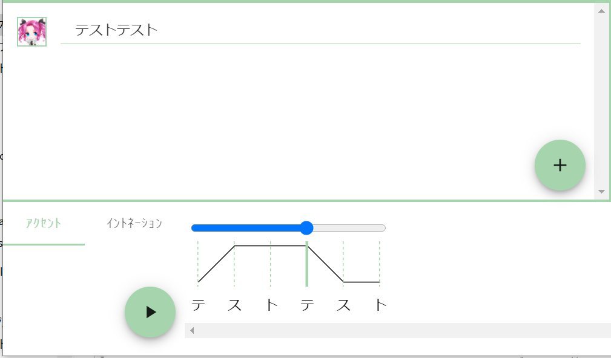

再生ボタンを押すと音声が生成され、音声が再生されます。

## 文章の追加・削除
右下の＋ボタンを押すとテキスト欄が増え、複数の文章を並べることができます。


またテキスト欄を空白にした状態でバックスペースキーを押すことで、テキスト欄を消去することができます。

## キャラクターの変更
テキスト入力欄の左にあるアイコンをクリックすると、テキストを読み上げてくれるキャラクターを変更することができます。

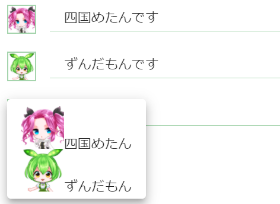

## 単語の接続変更
意図しない箇所で単語が分離していた場合や、意図しない形で結合してしまっている場合は、アクセント項目で文字の間をクリックすると解決できます。

例えば「ディープラーニング」がこのように分かれてしまった場合は、

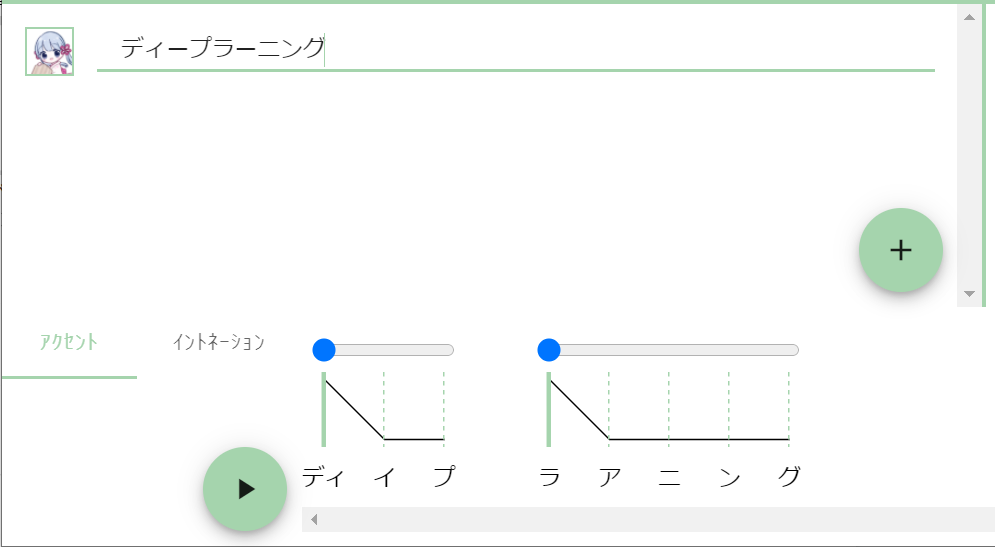

２つの隙間をクリックすると

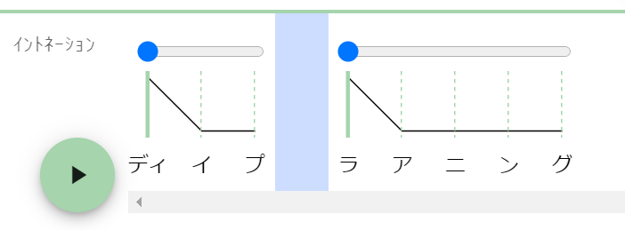

このように１語にまとめることができます

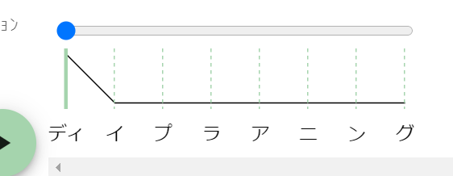

逆に切り離したい場合は、文字の間をクリックして切り離すことができます。

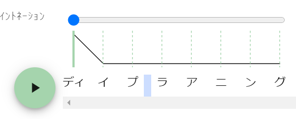

## アクセントの変更
音声の抑揚が意図しないものだった場合に、抑揚を変える方法が２つあります。まずはアクセント箇所を変えてみることをおすすめします。

アクセント箇所を変えるには、読みの上にあるバーを左右に動かします。
例えば「ディープラーニング」を「↑ディープラ↓アニング」と読んでほしい場合は、「ラ」の位置まで丸をスライドします。  

  
↓  
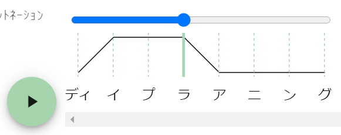

## イントネーションの変更
アクセントを変更してもうまく行かなかったときや、抑揚をより拘りたいときに、文字ごとのイントネーションを直接変更することができます。

「イントネーション」をクリックして現れる縦線のバーを上下させることで抑揚を表現できます。

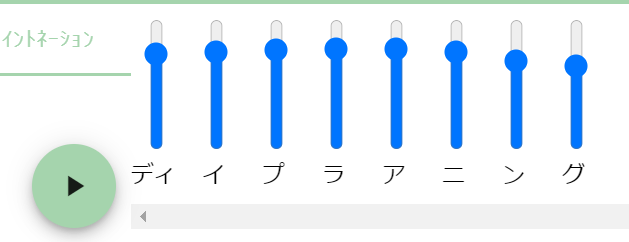

イントネーション調整スペースを縦に広くすることで、より細かく抑揚を調整することもできます。

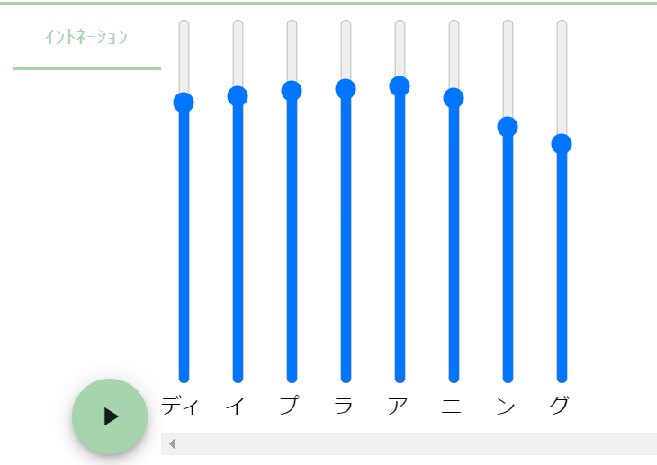

マウスホイールで調整することもできます。Ctrlキーを押しながらマウスホイールを使うと更に細かく調整できます。

また、「キ」や「ツ」や「ス」などが無声化されている場合、バーが灰色になっています。無声化を解く方法は今の所ありませんが、平仮名やカタカナにすることで回避することもできます。

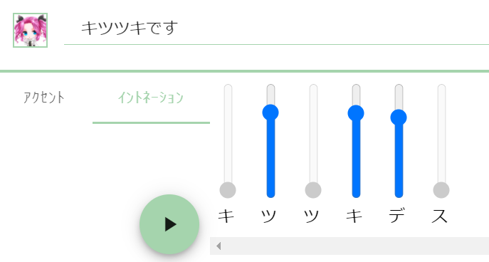
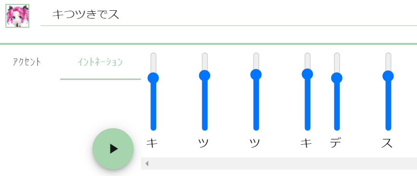

## 音声ファイル・テキストファイルの書き出し
書き出しボタンを押すと、全テキスト欄の音声がWAVファイルとして書き出されます。
ファイル保存時、ファイル名は[何行目]\_[キャラ名]\_[テキスト冒頭].wavとして保存されます。テキストファイルも同じファイル名.txtで保存されます。

## テキストファイルの読み込み
読み込みボタンを押すとテキストファイルを読み込めます。テキストは改行または半角コンマ（,）で区切ることで分割できます。また、キャラクター名だけで区切ることで、そのキャラクターとして読み込むことができます。

例えばこのようなテキストを読み込むと、
```
四国めたん,おはようございます,こんにちは
ずんだもん,こんばんは
四国めたん,さようなら
```

このように読み込まれます。

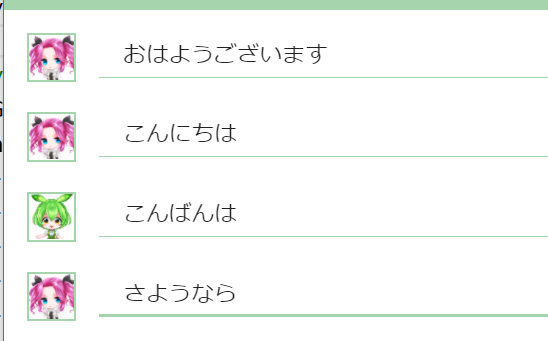

## プロジェクトファイルの保存・読み込み
入力したテキストやキャラクター、アクセント修正やイントネーションの調整結果は、プロジェクトファイルとして保存し、ソフトウェアを起動し直した後で読み込むことができます。

## ショートカットキー
* 上下キー
  * 上下のテキスト欄に移動
* Space
  * 音声を再生
* Shift + Enter
  * テキスト欄を追加
* Shift + Delete
  * テキスト欄を消去
* Ctrl + S
  * プロジェクトの保存
* Ctrl + E
  * 音声を書き出し
* 1
  * アクセント欄を表示
* 2
  * イントネーション欄を表示
* スライダーの上でマウスホイール
  * スライダーの値を変更します（スライダー→）

## 設定画面
右上の歯車マークから設定画面を表示できます。  
エンジンの起動モードの変更や、文字コードの変更ができます。

## その他
右上のピンボタンでウィンドウを最前面に固定できます。

## ヘルプ
利用規約などを確認することができます。

## アンインストール方法
インストーラー版でインストールした場合、インストールしたディレクトリの中にあるUninstall VOICEVOX.exeを実行してください。  
Zipファイルを解凍した場合、ダウンロードしたZIPファイルと、展開したディレクトリを消去すればアンインストール完了です。

## よくあるQ&A
### Q. エンジンの起動が失敗したというエラーが表示される
日本語が含まれるディレクトリで実行しているとこのエラーになります。この場合は、インストール先のディレクトリ（C:\Users\\[ユーザー名]\AppData\Local\Programs\voicevox）を別の場所（例えばC:\voicevox）に移動することで解決できます。  
他にも、対応するGPUがないパソコンでGPUモードとして起動するとこのエラーが表示されます。設定→エンジンからCPUモードを選んでください。  
もしくは、起動に必要なファイルをウイルス対策ソフトが消去している場合があります。ウイルス対策ソフトをご確認ください。

### Q. 音声が再生されない
エンジンのGPUモードで起動された場合は、一度CPUモードをお試しください。（設定方法は１つ前で紹介しています。）  
また、ソフトウェアやPCを再起動することで再生されるようになることもあります。一度お試しください。

### Q. 長いテキストの音声が再生できない
GPUモードでよく発生する現象で、長い音声を生成するには多くのメモリが必要になり、メモリが溢れてエラーが発生します。よりメモリが多いGPUに乗り換えるか、CPUモードをご利用ください。

### Q. 「、」で区切った短い文節が読まれないことがある
現状の音声合成エンジンの仕様になります。その文節をもう１つ追加するとうまく読まれることがあるのでお試しください。例：「はい、わかりました」→「はい、はい、わかりました」

## ご感想・ご要望・バグ報告など
ご感想・ご要望は、ぜひTwitterにてハッシュタグ #VOICEVOX を付けてツイートしてください。（開発の励みになります。）

うまく動かない場合もTwitterでハッシュタグ #VOICEVOX を付けてツイートしてみてください。同じ問題を解決された方から解決策を聞けるかもしれません。

バグを見つけられた方は開発者までご報告いただけると助かります。  
ヒホ　[https://twitter.com/hiho_karuta](https://twitter.com/hiho_karuta)
