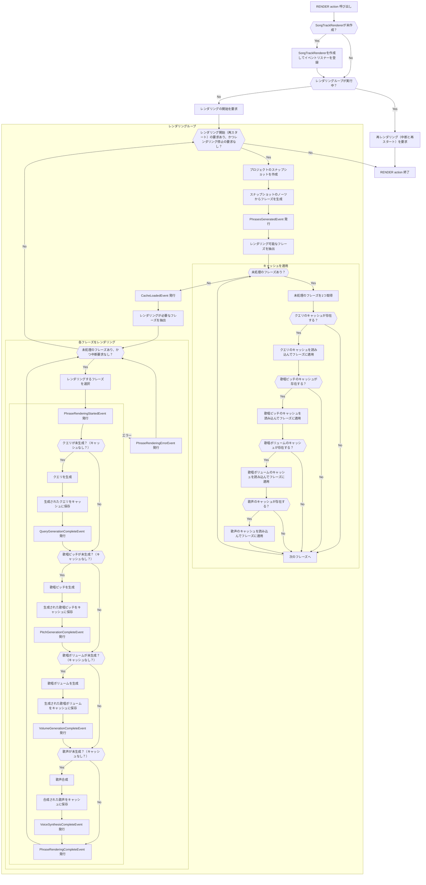

# ソングのレンダリングのフローチャート

```mermaid
graph TD
    RenderCall["RENDER action 呼び出し"]
    RenderCall --> RendererMissing{{"SongTrackRendererが未作成？"}}
    RendererMissing -- Yes --> CreateRenderer["SongTrackRendererを作成してイベントリスナーを登録"]
    RendererMissing -- No --> LoopRunning{{"レンダリングループが実行中？"}}
    CreateRenderer --> LoopRunning
    LoopRunning -- Yes --> ReRenderRequest["再レンダリング（中断と再スタート）を要求"]
    ReRenderRequest --> RenderEnd["RENDER action 終了"]
    LoopRunning -- No --> StartRenderRequest["レンダリングの開始を要求"]
    StartRenderRequest --> CanStart{{"レンダリング開始（再スタート）の要求あり、かつレンダリング停止の要求なし？"}}
    CanStart -- No --> RenderEnd

    subgraph RenderingLoop["レンダリングループ"]
        CanStart -- Yes --> TakeSnapshot["プロジェクトのスナップショットを作成"]
        TakeSnapshot --> GeneratePhrases["スナップショットのノーツからフレーズを生成"]
        GeneratePhrases --> PhrasesGeneratedEvent["PhrasesGeneratedEvent 発行"]
        PhrasesGeneratedEvent --> FilterRenderablePhrases["レンダリング可能なフレーズを抽出"]
        FilterRenderablePhrases --> HasUnprocessedPhrases{{"未処理のフレーズあり？"}}

        subgraph LoadCache["キャッシュを適用"]
            HasUnprocessedPhrases -- Yes --> GetUnprocessedPhrase["未処理のフレーズを1つ取得"]
            GetUnprocessedPhrase --> HasQueryCache{{"クエリのキャッシュが存在する？"}}
            HasQueryCache -- No --> NextPhrase["次のフレーズへ"]
            HasQueryCache -- Yes --> LoadQueryCache["クエリのキャッシュを読み込んでフレーズに適用"]

            LoadQueryCache --> HasPitchCache{{"歌唱ピッチのキャッシュが存在する？"}}
            HasPitchCache -- No --> NextPhrase
            HasPitchCache -- Yes --> LoadPitchCache["歌唱ピッチのキャッシュを読み込んでフレーズに適用"]

            LoadPitchCache --> HasVolumeCache{{"歌唱ボリュームのキャッシュが存在する？"}}
            HasVolumeCache -- No --> NextPhrase
            HasVolumeCache -- Yes --> LoadVolumeCache["歌唱ボリュームのキャッシュを読み込んでフレーズに適用"]

            LoadVolumeCache --> HasVoiceCache{{"歌声のキャッシュが存在する？"}}
            HasVoiceCache -- No --> NextPhrase
            HasVoiceCache -- Yes --> LoadVoiceCache["歌声のキャッシュを読み込んでフレーズに適用"]

            LoadVoiceCache --> NextPhrase
            NextPhrase --> HasUnprocessedPhrases
        end

        HasUnprocessedPhrases -- No --> CacheLoadedEvent["CacheLoadedEvent 発行"]
        CacheLoadedEvent --> FilterPhrasesRequiringRender["レンダリングが必要なフレーズを抽出"]
        FilterPhrasesRequiringRender --> CanRender{{"未処理のフレーズあり、かつ中断要求なし？"}}

        subgraph RenderPhrases["各フレーズをレンダリング"]
            CanRender -- Yes --> SelectPhrase["レンダリングするフレーズを選択"]
            SelectPhrase --> PhraseRenderingStartedEvent["PhraseRenderingStartedEvent 発行"]

            subgraph RenderPhrase[" "]
                PhraseRenderingStartedEvent --> QueryNotGenerated{{"クエリが未生成？（キャッシュなし？）"}}
                QueryNotGenerated -- Yes --> GenerateQuery["クエリを生成"]
                GenerateQuery --> CacheGeneratedQuery["生成されたクエリをキャッシュに保存"]
                QueryNotGenerated -- No --> PitchNotGenerated{{"歌唱ピッチが未生成？（キャッシュなし？）"}}

                CacheGeneratedQuery --> QueryGenerationCompleteEvent["QueryGenerationCompleteEvent 発行"]
                QueryGenerationCompleteEvent --> PitchNotGenerated

                PitchNotGenerated -- Yes --> GeneratePitch["歌唱ピッチを生成"]
                GeneratePitch --> CacheGeneratedPitch["生成された歌唱ピッチをキャッシュに保存"]
                PitchNotGenerated -- No --> VolumeNotGenerated{{"歌唱ボリュームが未生成？（キャッシュなし？）"}}

                CacheGeneratedPitch --> PitchGenerationCompleteEvent["PitchGenerationCompleteEvent 発行"]
                PitchGenerationCompleteEvent --> VolumeNotGenerated

                VolumeNotGenerated -- Yes --> GenerateVolume["歌唱ボリュームを生成"]
                GenerateVolume --> CacheGeneratedVolume["生成された歌唱ボリュームをキャッシュに保存"]
                VolumeNotGenerated -- No --> VoiceNotGenerated{{"歌声が未生成？（キャッシュなし？）"}}

                CacheGeneratedVolume --> VolumeGenerationCompleteEvent["VolumeGenerationCompleteEvent 発行"]
                VolumeGenerationCompleteEvent --> VoiceNotGenerated

                VoiceNotGenerated -- Yes --> SynthesizeVoice["歌声合成"]
                SynthesizeVoice --> CacheSynthesizedVoice["合成された歌声をキャッシュに保存"]
                VoiceNotGenerated -- No --> PhraseRenderingCompleteEvent["PhraseRenderingCompleteEvent 発行"]

                CacheSynthesizedVoice --> VoiceSynthesisCompleteEvent["VoiceSynthesisCompleteEvent 発行"]
                VoiceSynthesisCompleteEvent --> PhraseRenderingCompleteEvent
            end

            PhraseRenderingErrorEvent["PhraseRenderingErrorEvent 発行"]
            PhraseRenderingCompleteEvent --> CanRender
            PhraseRenderingErrorEvent --> CanRender
            RenderPhrase -- エラー --> PhraseRenderingErrorEvent
        end

        CanRender -- No --> CanStart
    end
```
