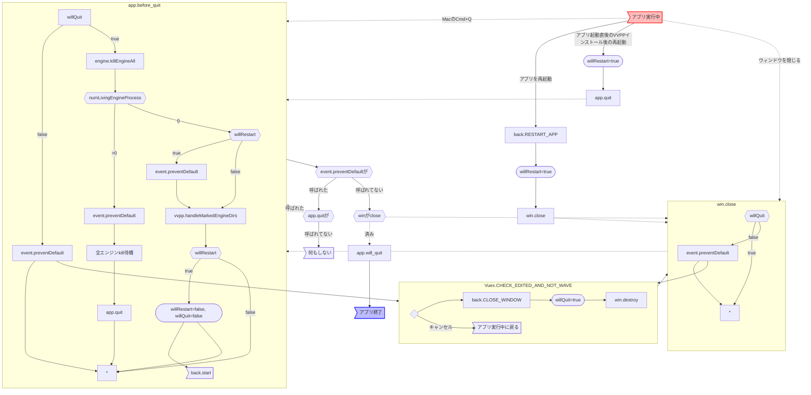

```mermaid
flowchart
  node_1>"アプリ実行中"] -->|"アプリを再起動"| node_3["back.RESTART_APP"]
  style node_1 fill:#ffbbbb,stroke:#ff0000
  node_3 --> node_4(["willRestart=true"])
  node_1 -.->|"MacのCmd+Q"| subgraph_2["app.before_quit"]
  subgraph_1["win.close"] -.-> subgraph_2
  node_21{{"winがclose"}} -.->|"済み"| node_22["app.will_quit"]
  node_21 -.->|"してない"| subgraph_1
  node_22 --> node_23>"アプリ終了"]
  style node_23 fill:#bbbbff,stroke:#0000ff
  node_25{{"app.quitが"}} -.->|"呼ばれた"| subgraph_2
  node_1 -->|"アプリ起動直後のVVPPインストール後の再起動"| 132024(["willRestart=true"])
  132024 --> 512010["app.quit"]
  512010 -.-> subgraph_2
  438128["win.close"] -.-> subgraph_1
  node_1 -.->|"ウィンドウを閉じる"| subgraph_1
  node_4 --> 438128
  subgraph_2 --> 497079{{"event.preventDefaultが"}}
  497079 -->|"呼ばれた"| node_25
  node_25 -->|"呼ばれてない"| 277313>"何もしない"]
  497079 -->|"呼ばれてない"| node_21
  571782["Vuex.CHECK_EDITED_AND_NOT_WAVE"] --> subgraph_1
  442878["event.preventDefault"] --> 571782
  node_9["event.preventDefault"] --> 571782
  subgraph 571782["Vuex.CHECK_EDITED_AND_NOT_WAVE"]
    node_5["back.CLOSE_WINDOW"] --> node_7(["willQuit=true"])
    node_7 --> node_8["win.destroy"]
    453066{" "} -->|"キャンセル"| node_6>"アプリ実行中に戻る"]
    453066 --> node_5
  end
  subgraph subgraph_2["app.before_quit"]
    c["willQuit"] -->|"false"| node_9
    node_13["event.preventDefault"] --> node_14["全エンジンkill待機"]
    node_14 --> node_15["app.quit"]
    node_15 --> d["*"]
    node_17["event.preventDefault"] --> node_18["vvpp.handleMarkedEngineDirs"]
    node_19(["willRestart=false, willQuit=false"]) --> node_20>"back.start"]
    node_12["engine.killEngineAll"] --> 889691{{"numLivingEngineProcess"}}
    889691 -->|"&gt;0"| node_13
    889691 -->|"0"| 701221{{"willRestart"}}
    701221 -->|"true"| node_17
    701221 -->|"false"| node_18
    node_18 --> 749060{{"willRestart"}}
    749060 -->|"true"| node_19
    749060 -->|"false"| d
    node_19 --> d
    c -->|"true"| node_12
    node_9 --> d
  end
  subgraph subgraph_1["win.close"]
    a{{"willQuit"}} -->|"true"| b["*"]
    a -->|"false"| 442878
    442878 --> b
  end
```
