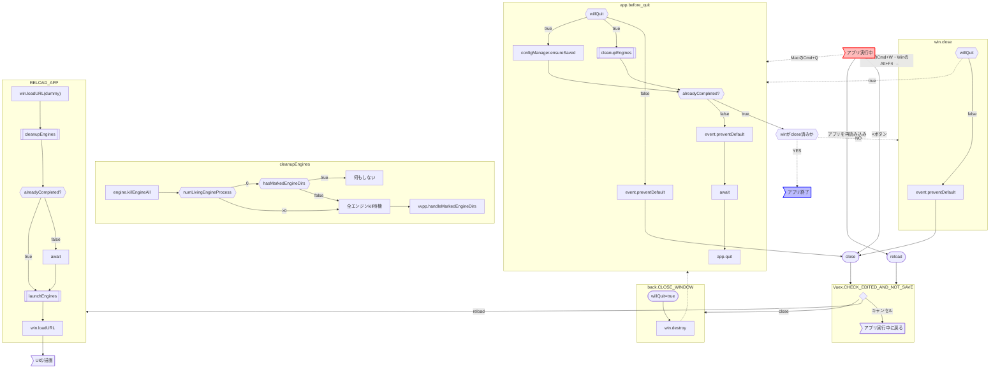

# 終了シーケンス図

```mermaid
flowchart TD
  node_1>"アプリ実行中"] -.->|"MacのCmd+Q"| subgraph_2["app.before_quit"]
  style node_1 fill:#ffbbbb,stroke:#ff0000
  node_21{{"winがclose済みか"}} -.->|"NO"| subgraph_1["win.close"]
  node_1 -.->|"MacのCmd+W・WinのAlt+F4"| subgraph_1
  node_15["app.quit"] -.-> subgraph_2
  a{{"willQuit"}} -.->|"true"| subgraph_2
  node_21 -.->|"YES"| node_23>"アプリ終了"]
  style node_23 fill:#bbbbff,stroke:#0000ff
  846215{" "} -->|"reload"| 186768["RELOAD_APP"]
  node_1 -->|"×ボタン"| 295190(["close"])
  node_1 -->|"アプリを再読み込み"| 929152(["reload"])
  846215 -->|"close"| 208965["back.CLOSE_WINDOW"]
  node_9["event.preventDefault"] --> 295190
  295190 --> 571782["Vuex.CHECK_EDITED_AND_NOT_SAVE"]
  929152 --> 571782
  177756{{"alreadyCompleted?"}} -->|"true"| node_21
  442878["event.preventDefault"] --> 295190
  node_8["win.destroy"] -.-> subgraph_2
  705785[["cleanupEngines"]] ~~~ 793927["cleanupEngines"]
  198115["win.loadURL"] --> 562861>"UIの描画"]
  454139[["cleanupEngines"]] ~~~ 793927
  subgraph 186768["RELOAD_APP"]
    705785 --> 700765{{"alreadyCompleted?"}}
    700765 -->|"false"| 462289["await"]
    700765 -->|"true"| 464405[["launchEngines"]]
    462289 --> 464405
    464405 --> 198115
    494918["win.loadURL(dummy)"] --> 705785
  end
  subgraph 208965["back.CLOSE_WINDOW"]
    node_7(["willQuit=true"]) --> node_8
  end
  subgraph 571782["Vuex.CHECK_EDITED_AND_NOT_SAVE"]
    846215 -->|"キャンセル"| node_6>"アプリ実行中に戻る"]
  end
  subgraph 793927["cleanupEngines"]
    node_12["engine.killEngineAll"] --> 889691{{"numLivingEngineProcess"}}
    889691 -->|"0"| 916552{{"hasMarkedEngineDirs"}}
    node_14["全エンジンkill待機"] --> node_18["vvpp.handleMarkedEngineDirs"]
    889691 -->|">0"| node_14
    916552 -->|"false"| node_14
    916552 -->|"true"| 655722["何もしない"]
  end
  subgraph subgraph_2["app.before_quit"]
    c{{"willQuit"}} -->|"false"| node_9
    c -->|"true"| 454139
    177756 -->|"false"| node_13["event.preventDefault"]
    node_13 --> 322763["await"]
    322763 --> node_15
    925653["configManager.ensureSaved"] --> 177756
    454139 --> 177756
    c -->|"true"| 925653
  end
  subgraph subgraph_1["win.close"]
    a -->|"false"| 442878
  end
```
