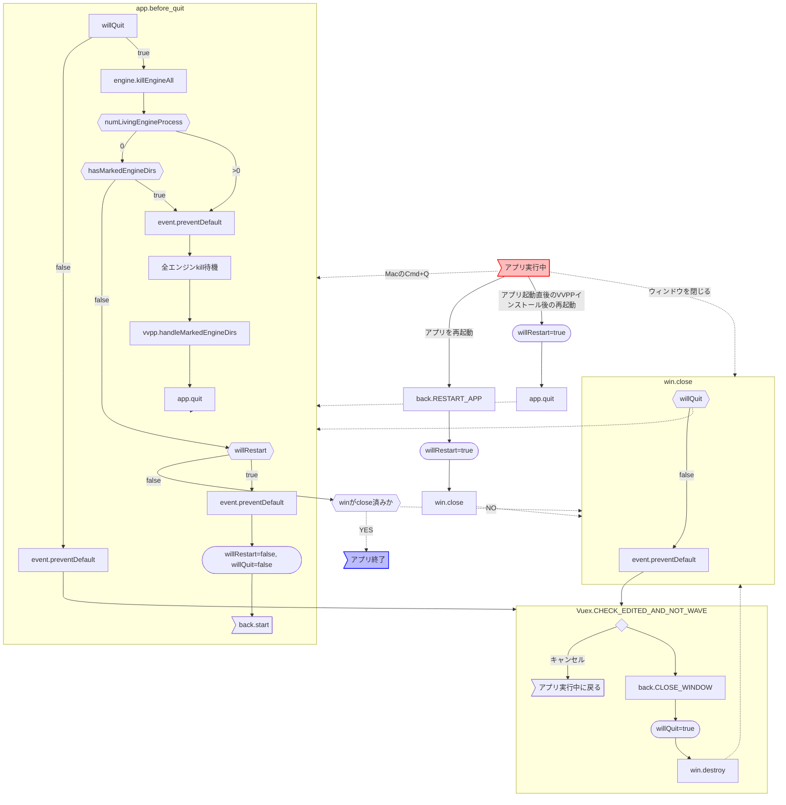

# 終了シーケンス図

```mermaid
flowchart
  node_1>"アプリ実行中"] -->|"アプリを再起動"| node_3["back.RESTART_APP"]
  style node_1 fill:#ffbbbb,stroke:#ff0000
  node_3 --> node_4(["willRestart=true"])
  node_1 -.->|"MacのCmd+Q"| subgraph_2["app.before_quit"]
  node_21{{"winがclose済みか"}} -.->|"NO"| subgraph_1["win.close"]
  node_1 -->|"アプリ起動直後のVVPPインストール後の再起動"| 132024(["willRestart=true"])
  132024 --> 512010["app.quit"]
  512010 -.-> subgraph_2
  438128["win.close"] -.-> subgraph_1
  node_1 -.->|"ウィンドウを閉じる"| subgraph_1
  node_4 --> 438128
  442878["event.preventDefault"] --> 571782["Vuex.CHECK_EDITED_AND_NOT_WAVE"]
  node_9["event.preventDefault"] --> 571782
  node_15["app.quit"] -.-> subgraph_2
  a{{"willQuit"}} -.-> subgraph_2
  node_8["win.destroy"] -.-> subgraph_1
  701221{{"willRestart"}} -->|"false"| node_21
  node_21 -.->|"YES"| node_23>"アプリ終了"]
  style node_23 fill:#bbbbff,stroke:#0000ff
  subgraph 571782["Vuex.CHECK_EDITED_AND_NOT_WAVE"]
    node_5["back.CLOSE_WINDOW"] --> node_7(["willQuit=true"])
    node_7 --> node_8
    453066{" "} -->|"キャンセル"| node_6>"アプリ実行中に戻る"]
    453066 --> node_5
  end
  subgraph subgraph_2["app.before_quit"]
    c["willQuit"] -->|"false"| node_9
    node_13["event.preventDefault"] --> node_14["全エンジンkill待機"]
    node_19(["willRestart=false, willQuit=false"]) --> node_20>"back.start"]
    node_12["engine.killEngineAll"] --> 889691{{"numLivingEngineProcess"}}
    701221 -->|"true"| node_17["event.preventDefault"]
    c -->|"true"| node_12
    889691 -->|"0"| 916552{{"hasMarkedEngineDirs"}}
    916552 -->|"false"| 701221
    916552 -->|"true"| node_13
    node_17 --> node_19
    node_14 --> node_18["vvpp.handleMarkedEngineDirs"]
    node_18 --> node_15
    889691 -->|">0"| node_13
  end
  subgraph subgraph_1["win.close"]
    a -->|"false"| 442878
  end
```
