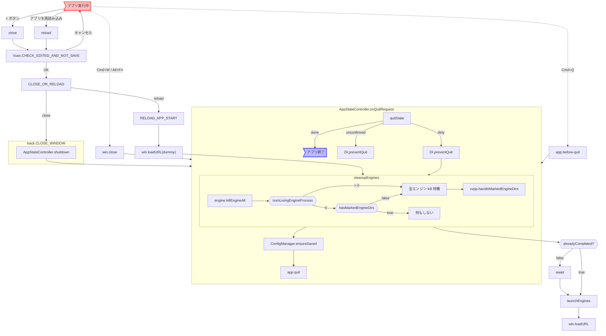

# 終了シーケンス図

```mermaid
flowchart TD

RUNNING>"アプリ実行中"]
END>"アプリ終了"]

style RUNNING fill:#ffbbbb,stroke:#ff0000
style END fill:#bbbbff,stroke:#0000ff

RUNNING -->|"× ボタン"| CLOSE_EVT["close"]
RUNNING -->|"アプリを再読み込み"| RELOAD_EVT["reload"]
RUNNING -.->|"Cmd+W / Alt+F4"| win_close
RUNNING -.->|"Cmd+Q"| app_before_quit

CLOSE_EVT --> CHECK_EDIT["Vuex.CHECK_EDITED_AND_NOT_SAVE"]
RELOAD_EVT --> CHECK_EDIT

CHECK_EDIT -->|"キャンセル"| RUNNING
CHECK_EDIT -->|"OK"| CLOSE_OR_RELOAD

CLOSE_OR_RELOAD -->|"close"| back_CLOSE_WINDOW
CLOSE_OR_RELOAD -->|"reload"| RELOAD_APP_START

win_close["win.close"] --> AppStateController_onQuitRequest

subgraph back_CLOSE_WINDOW["back.CLOSE_WINDOW"]
  call_shutdown["AppStateController.shutdown"]
end
call_shutdown --> AppStateController_onQuitRequest

subgraph CLEANUP["cleanupEngines"]
  KILL_ALL["engine.killEngineAll"]
  KILL_ALL --> COUNT{{numLivingEngineProcess}}

  COUNT -->|" > 0 "| WAIT_KILL["全エンジン kill 待機"]
  WAIT_KILL --> HANDLE_DIR["vvpp.handleMarkedEngineDirs"]

  COUNT -->|"0"| MARKED{{hasMarkedEngineDirs}}
  MARKED -->|"false"| WAIT_KILL
  MARKED -->|"true"| NOOP["何もしない"]
end

RELOAD_APP_START --> LOAD_DUMMY["win.loadURL(dummy)"]
LOAD_DUMMY --> CLEANUP
CLEANUP --> COMPLETED{{alreadyCompleted?}}
COMPLETED -->|"false"| WAIT["await"]
WAIT --> LAUNCH
COMPLETED -->|"true"| LAUNCH
LAUNCH["launchEngines"] --> LOAD_UI["win.loadURL"]

app_before_quit["app.before-quit"] --> AppStateController_onQuitRequest

subgraph AppStateController_onQuitRequest["AppStateController.onQuitRequest"]
  quitState["quitState"]
  ensureSaved["ConfigManager.ensureSaved"]
  appQuit["app.quit"]

  quitState -->|"unconfirmed"| preventQuit1["DI.preventQuit"]
  quitState -->|"dirty"| preventQuit2["DI.preventQuit"]
  preventQuit2 --> CLEANUP
  CLEANUP --> ensureSaved
  ensureSaved --> appQuit

  quitState -->|"done"| END
end
```
