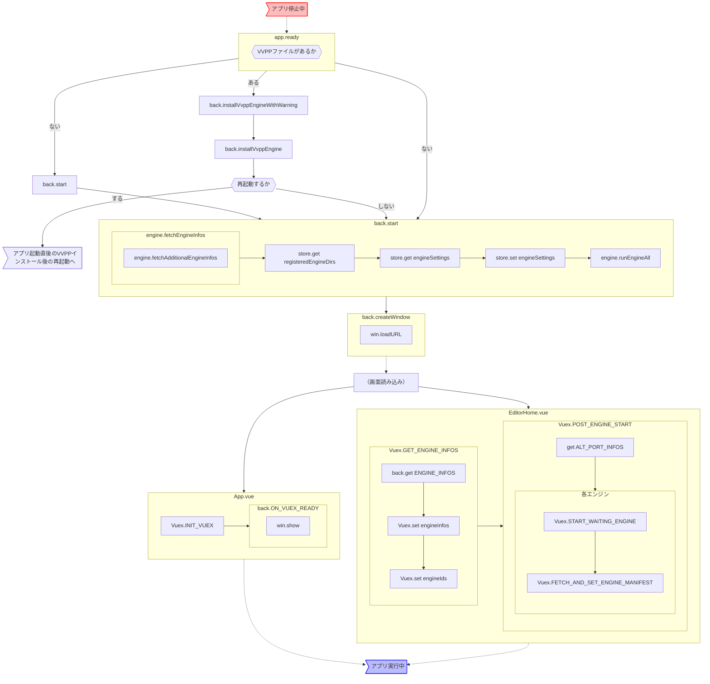

# 起動シーケンス図

```mermaid
flowchart
  174170["back.installVvppEngineWithWarning"] --> 786961["back.installVvppEngine"]
  786961 --> 409576{{"再起動するか"}}
  409576 -->|"する"| 173803>"アプリ起動直後のVVPPインストール後の再起動へ"]
  358108["back.start"] --> 389651["back.start"]
  764022["（画面読み込み）"] --> 698565["App.vue"]
  764022 --> 332024["EditorHome.vue"]
  389651 --> 733212["back.createWindow"]
  733212 -.-> 764022
  448821>"アプリ停止中"] -.-> 430173["app.ready"]
  style 448821 fill:#ffbbbb,stroke:#ff0000
  430173 -->|"ない"| 358108
  430173 -->|"ある"| 174170
  409576 -->|"しない"| 389651
  430173 -->|"ない"| 389651
  698565 -.-> 704891>"アプリ実行中"]
  style 704891 fill:#bbbbff,stroke:#0000ff
  332024 -.-> 704891
  subgraph 332024["EditorHome.vue"]
    709863["Vuex.GET_ENGINE_INFOS"] --> 773040["Vuex.POST_ENGINE_START"]
    subgraph 773040["Vuex.POST_ENGINE_START"]
      970396["get ALT_PORT_INFOS"] --> 467527["各エンジン"]
      subgraph 467527["各エンジン"]
        592206["Vuex.START_WAITING_ENGINE"] --> 799767["Vuex.FETCH_AND_SET_ENGINE_MANIFEST"]
      end
    end
    subgraph 709863["Vuex.GET_ENGINE_INFOS"]
      807081["back.get ENGINE_INFOS"] --> 423649["Vuex.set engineInfos"]
      423649 --> 623418["Vuex.set engineIds"]
    end
  end
  subgraph 389651["back.start"]
    250263["store.get engineSettings"] --> 222321["store.set engineSettings"]
    870482["store.get registeredEngineDirs"] --> 250263
    222321 --> 967432["engine.runEngineAll"]
    656570["engine.fetchEngineInfos"] --> 870482
    subgraph 656570["engine.fetchEngineInfos"]
      267019["engine.fetchAdditionalEngineInfos"]
    end
  end
  subgraph 430173["app.ready"]
    546251{{"VVPPファイルがあるか"}}
  end
  subgraph 698565["App.vue"]
    646647["Vuex.INIT_VUEX"] --> 632374["back.ON_VUEX_READY"]
    subgraph 632374["back.ON_VUEX_READY"]
      225701["win.show"]
    end
  end
  subgraph 733212["back.createWindow"]
    613440["win.loadURL"]
  end
```
