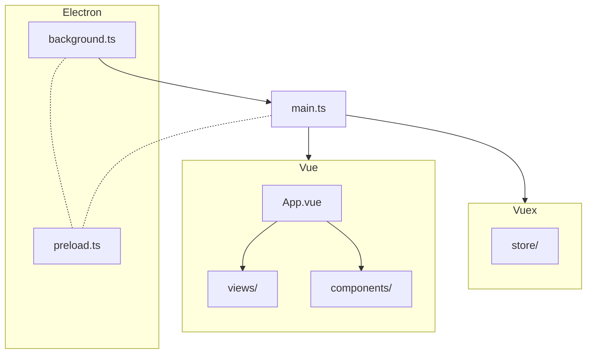
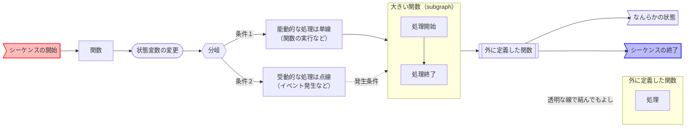

# VOICEVOX エディタのコードの歩き方

VOICEVOX のエディタは Electron・TypeScript・Vue・Vuex などが活用されており、全体構成がわかりにくくなっています。
ここではどういう構成になっているのかを紹介します。コードを読む上で参考になれば幸いです。

## コードが実行される順番

とにかくコードを読みたい方向けに、コードが実行される順番を簡潔に説明します。わかりやすさを優先したため正確な表現でない箇所もあることにご注意ください。

1. electron がアプリケーションを起動します。このとき実行されるコードが `src/backend/electron/main.ts` です。
2. `src/backend/electron/main.ts`から UI 表示のためのウィンドウを起動します。このとき実行されるコードが `src/main.ts` です。
3. `main.ts`が Vue を使って UI がレンダリングされます。UI のルートコンポーネントが `src/App.vue` です。
4. `src/App.vue`が様々な UI を呼び出します。`src/views`や`src/components`にそれぞれの UI があります。
5. UI のレンダリングと同時に、アプリの状態やロジックを管理する Vuex のストアが初期化されます。`src/store`ディレクトリに Vuex 用のコードがあります。
6. これらのコードは全て TypeScript で書かれています。Vue や TypeScript のコードは実行・ビルド時に自動的に JavaScript へトランスパイルされます。

また electron は、最初に起動するプロセス（メインプロセス）と UI ウィンドウ用のプロセス（レンダラープロセス）で通信するために、プリロードスクリプト`src/backend/electron/preload.ts`を両方から読み込みます。

## 設計

ここではバックエンド周り・Vuex 周り・UI 周りの設計方針を簡単に紹介します。

### バックエンドとは

バックエンドとは、Web ブラウザ（ Electron のレンダラープロセス含め）で完結しない処理を行う部分のことです。
例えば以下のものをバックエンドで行っています。

- 音声合成エンジンの起動・終了
- ファイルの読み書き
- 設定の読み書き

現在、以下のバックエンドが存在します。

- Electron（`src/backend/electron/`）
  - 製品版ではこれを使っています。
  - すべてのバックエンドはこれのインターフェースをベースに作られています。
- ブラウザ（`src/backend/browser/`）
  - テストではこれを使っています。
  - DevContainer 内や WSL 内など、 Electron を使うのが難しい場合にも使えます。
  - Web API を使って、 Electron の機能を再現しています。
  - 例えば音声合成エンジンの起動・終了など、一部の機能は実装されていません。

バックエンドは `window.backend` を通してアクセスできますが、直接アクセスするのではなく、 Vuex のストアを介してアクセスすることが推奨されます。
詳しくは Vuex のセクションをご覧ください。

### Electron 周り（`src/backend/electron/`）

製品版 VOICEVOX では、Electron を使ってバックエンドを実装しています。
Electron バックエンドの主な構成要素は以下の通りです。

- `main.ts`：Electron のメインプロセスとして起動するエントリポイントです。アプリケーションのライフサイクル管理やウィンドウ作成などを行います。
- IPC関連（`ipc.ts`, `ipcMainHandle.ts`など）：メインプロセスとレンダラープロセス間の通信を担います。レンダラープロセスからのリクエストを受け取り、適切な機能を呼び出します。
- 各機能モジュール（`engineAndVvppController.ts`、`manager/`下など）：音声合成エンジンの管理などの具体的な機能を実装しています。
- `renderer/`：レンダラープロセス側からバックエンド機能を利用するためのコードが含まれています。

これらのモジュールが連携して、Electron 環境でのバックエンド処理を実現しています。

また、 DisplayableError を Electron の IPC 通信（メインプロセス・preload間、preload間・mainWorld間）を挟んでも DisplayableError として扱えるように、`TransferableResult` という型を定義し、一旦それに包んで IPC 通信を行っています。

### Vuex 周り（`src/store/`）

VOICEVOX では動的に変更される状態と、状態を変更する関数を、Vuex の`Store`を介して管理しています。
`Store`は音声・エンジン・UI などそれぞれの目的に応じて分割し、`src/store/index.ts`で統合しています。

Vuex の仕様を少し説明します。
状態は`State`に保存し、状態の変更は`Mutation`で行います。
`Mutation`は同期的に実行される必要がありますが、非同期処理を行いたい場合は`Action`を使います。
VOICEVOX 内では、UI から実行するものは`Action`を介するようにして、`Action`内から`Mutation`を実行するようにしています。
これは後述する Undo/Redo 機構のための設計です。

Vuex は型サポートが不十分なので、VOICEVOX では独自に型周りの機構を作っています（`src/store/type.ts`）。
関数を定義したい場合は、まず`type.ts`に型を宣言し、対応する`Store`内に実装します。

UI からバックエンドやエンジンにアクセスしたい場合は、必ず Vuex を介するようにしています。
これは Vuex の元の思想である Flux の考え方を引き継いでいて、外部にアクセスすることで生じる予想外な状態の変更などをなるべく一元管理するためです。

VOICEVOX では Vuex の`Mutation`をラップする形で Undo/Redo 機構を実現しています。
状態 A→B の変更を行った時、自動的にその逆方向 B→A の変更が Undo スタックに積まれます。
詳細は[Undo/Redo を実装したい #116](https://github.com/VOICEVOX/voicevox/issues/116)をご参照ください。

### UI 周り（`src/components/`）

TODO

## ソースコードのディレクトリ構成

- `src/`
  - `backend/`：バックエンドのコードが置かれるディレクトリ。
    - `electron/`：Electron 版バックエンドのコードが置かれるディレクトリ。
    - `browser/`：ブラウザ版バックエンドのコードが置かれるディレクトリ。
    - `common/`：Electron とブラウザの両方で使うバックエンドのコードが置かれるディレクトリ。
  - `main.ts`：ウィンドウを表示するために最初に実行されるコード。ここで Vue や Vuex を組み込む。
  - `App.vue`：Vue のルートになるコンポーネント。他の全てのコンポーネントの親。
  - `components/`：UI のパーツになる Vue コンポーネントディレクトリ。
    - 具体的にどの UI と対応しているかについては、[UI 名称と Vue ファイル名の対応早見表](UI名称とVueファイル名の対応早見表.md) もご参照ください。
  - `store/`： Vuex のストアのディレクトリ。アプリのロジックの大半はここに書かれる。
  - `type/`：TypeScript 用の型定義などが入るディレクトリ。
  - `composables/`：Vue コンポーザブルを置くディレクトリ。
  - `domain/`：ドメインロジックや便利関数を置く場。
  - `styles/`：CSS や SCSS などのディレクトリ。
  - `infrastructures/`：UI 用のコードと UI 以外のコードを跨ぐときに一枚かませたいときのためのコードのディレクトリ。
  - `plugins/`：Vue プラグインを置くディレクトリ。
  - `sing/`：ソング関連のコードを置くディレクトリ。
  - `openapi/`：エンジンの API を叩くためのコードのディレクトリ。OpenAPI で自動生成される。
  - `helpers/`：便利な関数を置くディレクトリ。
- `public/`：アプリのリソースファイルが置かれるディレクトリ。
- `build/`：ビルドに必要なファイルが置かれるディレクトリ。
- `tests/`
  - `e2e/`：End to End テストのコードが置かれるディレクトリ。
    - `browser/`：ブラウザ版の End to End テストのコードが置かれるディレクトリ。
    - `electron/`：Electron 版の End to End テストのコードが置かれるディレクトリ。
    - `storybook/`：Storybook の VRT（Visual Regression Testing）テストのコードが置かれるディレクトリ。
      - テスト自体は End to End ではありませんが、 Storybook を使っている関係上、 `e2e` ディレクトリに置いています。
  - `unit/`：単体テストのコードが置かれるディレクトリ。
  - `env/`：テスト用の環境変数ファイルが置かれるディレクトリ。
- `tools/`：開発用のツールやスクリプトが置かれるディレクトリ。
- `vendored/`
  - ダウンロードしたライブラリやツールが置かれるディレクトリ。
  - `pnpm install` 時に自動的にダウンロードされます。

## シーケンス図

- [起動シーケンス図](res/起動シーケンス図.md)
- [終了シーケンス図](res/終了シーケンス図.md)
- [エンジン再起動シーケンス図](res/エンジン再起動シーケンス図.md)

[Mermaid Flow](https://www.mermaidflow.app/)を用いて書いています。mermaid のコードをサイトに貼り付ければ再編集も可能です。記述ルールは以下参照。

処理の prefix 一覧

- back: backend/electron/main.ts の関数
- app: app のイベント
- win: win のイベント
- engine: EngineManager のメソッド
- store: electron-store のメソッド
- Vuex: Vuex の関数
