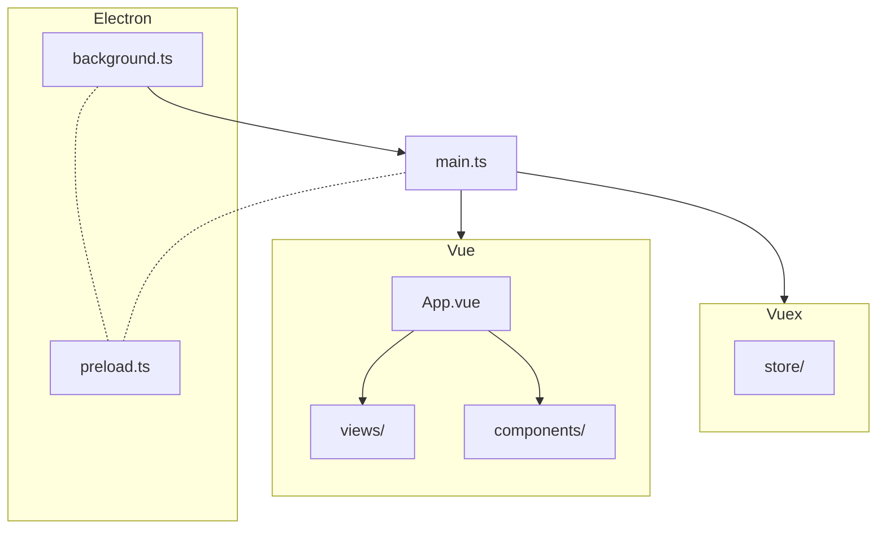

# VOICEVOX エディタのコードの歩き方

VOICEVOX のエディタは Electron・TypeScript・Vue・Vuex などが活用されており、全体構成がわかりにくくなっています。
ここではどういう構成になっているのかを紹介します。コードを読む上で参考になれば幸いです。

## コードが実行される順番

とにかくコードを読みたい方向けに、コードが実行される順番を簡潔に説明します。わかりやすさを優先したため正確な表現でない箇所もあることにご注意ください。

1. electron がアプリケーションを起動します。このとき実行されるコードが `src/background.ts` です。
2. `src/background.ts`から UI 表示のためのウィンドウを起動します。このとき実行されるコードが `src/main.ts` です。
3. `main.ts`が Vue を使って UI がレンダリングされます。UI のルートコンポーネントが `src/App.vue` です。
4. `src/App.vue`が様々な UI を呼び出します。`src/views`や`src/components`にそれぞれの UI があります。
5. UI のレンダリングと同時に、アプリの状態やロジックを管理する Vuex のストアが初期化されます。`src/store`ディレクトリに Vuex 用のコードがあります。
6. これらのコードは全て TypeScript で書かれています。Vue や TypeScript のコードは実行・ビルド時に自動的に JavaScript へトランスパイルされます。

また electron は、最初に起動するプロセス（メインプロセス）と UI ウィンドウ用のプロセス（レンダラープロセス）で通信するために、プリロードスクリプト`src/electron/preload.ts`を両方から読み込みます。

## 設計

ここでは Electron 周り・Vuex 周り・UI 周りの設計方針を簡単に紹介します。

### Electron 周り（`src/electron/`）

TODO

### Vuex 周り（`src/store/`）

VOICEVOX では動的に変更される状態と、状態を変更する関数を、Vuex の`Store`を介して管理しています。
`Store`は音声・エンジン・UI などそれぞれの目的に応じて分割し、`src/store/index.ts`で統合しています。

Vuex の仕様を少し説明します。
状態は`State`に保存し、状態の変更は`Mutation`で行います。
`Mutation`は同期的に実行される必要がありますが、非同期処理を行いたい場合は`Action`を使います。
VOICEVOX 内では、UI から実行するものは`Action`を介するようにして、`Action`内から`Mutation`を実行するようにしています。
これは後述する Undo/Redo 機構のための設計です。
関数は全て文字列を渡す形になっていますが、これも Vuex の仕様です。コードを追う際は文字列で全体検索を行うと便利です。

Vuex は型サポートが不十分なので、VOICEVOX では独自に型周りの機構を作っています（`src/store/type.ts`）。
関数を定義したい場合は、まず`type.ts`に型を宣言し、対応する`Store`内に実装します。

UI から Electron やエンジンにアクセスしたい場合は、必ず Vuex を介するようにしています。
これは Vuex の元の思想である Flux の考え方を引き継いでいて、外部にアクセスすることで生じる予想外な状態の変更などをなるべく一元管理するためです。

VOICEVOX では Vuex の`Mutation`をラップする形で Undo/Redo 機構を実現しています。
状態 A→B の変更を行った時、自動的にその逆方向 B→A の変更が Undo スタックに積まれます。
詳細は[Undo/Redo を実装したい #116](https://github.com/VOICEVOX/voicevox/issues/116)をご参照ください。

### UI 周り（`src/views/`・`src/components/`）

TODO

## ソースコードのディレクトリ構成

- src
  - background.ts ･･･ 最初に実行されるコード。ウィンドウを表示したり、エンジンを起動したりする。Electron のメインプロセス。
  - main.ts ･･･ ウィンドウを表示するために最初に実行されるコード。ここで Vue や Vuex を組み込む。
  - App.vue ･･･ Vue のルートになるコンポーネント。他の全てのコンポーネントの親。
  - views ディレクトリ ･･･ 画面全体を覆うような Vue コンポーネントのディレクトリ。
  - components ディレクトリ ･･･ UI のパーツになる Vue コンポーネントディレクトリ。
  - store ディレクトリ ･･･ Vuex のストアのディレクトリ。アプリのロジックの大半はここに書かれる。
  - electron ディレクトリ ･･･ Electron の ipc 通信などのコードが置かれるディレクトリ。
  - type ディレクトリ ･･･ TypeScript 用の型定義などが入るディレクトリ。
  - styles ディレクトリ ･･･ CSS や SCSS などのディレクトリ。
  - infrastructures ディレクトリ ･･･ UI 用のコードと UI 以外のコードを跨ぐときに一枚かませたいときのためのコードのディレクトリ。
  - openapi ディレクトリ ･･･ エンジンの API を叩くためのコードのディレクトリ。OpenAPI で自動生成される。
  - router ディレクトリ ･･･ Vue Router 用のディレクトリ。
  - helpers ディレクトリ ･･･ 便利な関数を置くディレクトリ。
- public
  - アプリのリソースファイルが置かれるディレクトリ。
- build
  - ビルドに必要なファイルが置かれるディレクトリ。

## シーケンス図

- [起動シーケンス図](res/起動シーケンス図.md)
- [終了シーケンス図](res/終了シーケンス図.md)
- [エンジン再起動シーケンス図](res/エンジン再起動シーケンス図.md)

[Mermaid Flow](https://www.mermaidflow.app/)を用いて書いています。コードに追加編集できるリンクがあるので、誰でもそこから改修できます。記述ルールは以下参照。

```mermaid
flowchart LR
	817736>"シーケンスの開始"] --> 584587["関数"]
	style 817736 fill:#ffbbbb,stroke:#ff0000
	584587 --> 965553(["状態変数の変更"])
	965553 --> 945949{{"分岐"}}
	945949 -->|"条件１"| 366994["<span>能動的な処理は単線</span><span>（関数の実行など）</span><span></span>"]
	945949 -->|"条件２"| 871294["受動的な処理は点線\fl°°110¶ß（イベント発生など）"]
	366994 --> 617606["大きい関数（subgraph）"]
	871294 -.->|"発生条件"| 617606
	617606 --> 314405>"なんらかの状態"]
	617606 --> 230853>"シーケンスの終了"]
	style 230853 fill:#bbbbff,stroke:#0000ff
	subgraph 617606["大きい関数（subgraph）"]
		776462["処理開始"] --> 992786["処理終了"]
	end

%% Mermaid Flow Diagram Link
%% Keep this link to make future edits to your diagram
%% https://www.mermaidflow.app/flowchart#N4IgZgNg9g7iBcoB2UAmBTAzgg2qGAlqgC4AWCATBQCwA0Ip6BA5qcQgIwUAc9RCICgGYADNwCsQkPQAOUTAWIEoSBKAAelCgHYKAOm0ShxnjW0A2c-QCeCIRQ56h4iueq7nQ8+O0BfeqgAhsSBaiAAxhCBmJhYuAC69JjE1hBx8DjgBBAQ8ADEAEZFBWBg0iDJAE5QANbo+SKNIqUgiSBRBegQAoDtDIA-DICNDIDPDICdDIB2DIBCvoBhcuWoBJXo4UoqAgAqAELllYFINZgAItswqoj+IDKBC0jEAEo7NQgiAUcAyilpCGCBELFnKTLoASQQLMAByaEBSXegNOsnkimUSAAggVMFAIABXYgwjRaXQGIwmbhmSw2OwOJwuNweSTePz+fBEMhaOgMJisdjwLi8ED8eAgIQcajUETicpyBTLE64+AUUUUMlcjhCJzGNXq9VnIIhMKRaKxbAZNrJVLpHBtDpdASAKwZAMkMgEiGQDSDGNAG1OgGlDWbzRZStabejbXYHI7Ss4XK63e6PZ6BGBvU0IYiVDHoP7WAFAqJgiHlE0fWHneFSlFozHYsKaWXyxUcZWqjX1oS+BkgQgkciVnmMFhsThcPioARecwATmH1HFhcR5c4Yh5tllkjrDbVHC1wVCiAiURiZuN0MN5volu6-IAPJgLkgAHyAX4DAKtKgBC3a2AM8VAGAugHsGQAayoAt31PAHoLx2K9z0vK9AAh-wAi1MAB1MxkAfO1ABkI61AEsGQBIf--QDrxAoD0NAz0FiWKd+Q2LZ7iDGMQ1kS50GuO5dijEBUFeaEEyTFN6H+GEQHwkIkGYNJwQwHNmPzCUERUYt0SxHEQArDhZ0VChF2XDVV2bVtmQ7eguw5XsFV5Ad+XEbhqCM7QJ0lQiZWFVl5yFag1x1Tc9R3A891NVyj0CToTxAaC8O9QiQGI-1SMOci1FDKiaMjeAngYpj43gRNk1TdN+W4nY+PQATIQqYTgFDSdxNRSSy03CtrOrYUm1oRk2wQcwvC09ke1lex+wEcwOAsERzHMsTpRkzgXEcUVBWVYRRW4YcOEVcQaz0cQusaYcuqEYcvA4cwHI3UBnINBIoXcw72i8q1+UAck1AFkGQARBmgsDMAxApmG2GRSBQ-yCJWIi-RAFAMAPEBRx0bg+vobQLGocwKFaELAzC44Irhh4uUo8NaJRuL0FQZgzVADiBHCDFkigABbcpScuOpKjeS5ORAKAAVUehKcqamAFEkAMgsCGucpeexbYvqQAB1Jl2zlI681AKpanQMX6q5M4+RAbHcYAWm8DhuEMbRjF0YccygDFKnCTiIbcaHyhCSpcfp4HDDBkAbbtgAJHZUDzEAOCNk2zfdrmvZ9gJ1zCY8BHKNJeI01S2kYmM4zzZK2OdtNOMe57XvIKXpPU9tGqsNlu05YQKEKizipLKTpy5Ea9DGmt7FEIyZrmhalrkkRVuVDauu2tTxcoMRmuL3SOv5B3QfFKLiByzruvMXr+p9cryTnBqRB23VtwOo0c4807vIEN9pk+legt+gM9gRijzhnjHOGjWNhOT1LOIy3j+OzHOkYLCvkRKqWaSsljLDnrpIRuk0W6zRAPOHwjgO4rTWr3MuA9FZyk7C1TkNY9IqwtlDGGaNqKz2zPyLqPUnaiRXjKTuipF5bycjvXc+8Trh35G+QA0amAGnNM+gVgpcVCsGX+YZiEP1RvFBOL9WJvwEB-LKc8f4iSKgAquZUaHQ1GhAiazdpowLgdoBBy0u7IK8Kg2qLZB6yhoCPHSXIeDjxANwbqetKHKJrnKfQQpnBQ2HIpEQuhC62S8AwvaTCD65jNFkHI+RSjFAKEJaodQYlgCaCIWGh9zogH6MMcY3DeHfQviReGQiRL3xinFeOz9EpfB+CnAm-JgRZkEoogqcJ-4SSAe4kQnjqDeJHH4gJ1ZgloI0hgmxrUcEOJ1lwMcy9LJDS5PJWBnAKTKQ1CErc+pmF5WOnvDJPlADryo+F8H5ACdDt+AAOhcwAQN8AAbbk1hEAANoAPtgUACUMgBNhiGIACYZABeboAfFdkIfQCF6YWvoinXxKa0u+6NylP0TjCV+7E06yO9JlL+zSdnS3LgNDp1dV6LO4OvOxjg1mahGRLRo4zsEiFZCrMc4gxyGzaQNGuFhHA0C8EIbQPhRS6Bsggagck9CWEed0plvSmXiA2ftbZESD5sJAIAMCVAAJOvkk4hTkZkURqUuFdFYoIqkSlFFaU2TqBBCoBR2KcS4qLIAglMoOV6C5Y1Xl2h+XWOWfAYVIhRVdU7opMczhhwyspUPOK2kJl0ocatcQ8apCsuoQs8wugqrcFlWEk6CrWFnR8u6QAkJowQLYAF7MNUQu1TfYRZSDUVISknaRprOIyGyBAa1EThHKPxWolNabvVCgzb4Noas8apzNUTEm5MWZU3QDTG29NGbUQpjOyonNuZyAFvza4s7AjCwVqMuKHbNyyzqPu9sq4HEjvVq4DgS0u7iBEMqMySRjam04k4iGXhraXDtgIIyJkdbfttugYgAdPacWDhUV9-sPZB1mKHTcSrI7UWYDHGq+NUX8gncQMmy62aztppUBdTM8Mcy5gIDdfM+DbqFlKM9Q8Wl5USfLSxF79ICCvdreawrXA6wcL7N9f7jKmSA7+ie3gE2iZA2BuDL6-boBkxB+DjlQBIaPChtDzZ6kRGJjhqdIBWbU0I8Rpd078OrvI-ySj7BqOC13XRyxksbVhBPSxxWbGVZXsXjrYkqbuCihZVB+TAg42SfYj+kDIWTLMqk6B2DSm5NvsUwISD2pdr7Ijup6O570Njs4th3DZmjPzoEIu5mBmV1roo1ATdtmd17sc4e-KTG5b0aVpenG6B1bCmMoKBNPmBNmyi5KwLLtIv8iHKOcc4XgNxcDgloLSX4speU+lpVgBDc0AG9ygBEf+Q9lzguXtMFf04ZgjJX+RldI7OqrVmatUd5DR+ziI2tOaPTLRMrXWPK25le4Ui8qBOKEMKSDaJgsT2i9QUbEX6bTIoLMmbbtlv8hB9BhTSPvarbDnmgQW3ABI-3t1DOWtOYZ05Oq7c66alZI0V67lmeb3YFvVhz6CmuJXe8xtrHmfudfVg7AxviNrOEG5xSb8PnbQ-nhQ2LyXkfC5lxjkOKmMv8gJ5p8xR3dOFYq+Z4zVPTPa7I+uu7NmHt2YayzxjrnOffY4zztwopGrdWJXD4XAhYdi7G-Tchi8nae-lyj+T-vMeIex-yQFW3Vc5foDsAglNsQGWRRh8dmuTsrt1xd6nBvadG9q6bpnz3GuW4+6er7HWNY0B8NQaaD7dDPsW0NshC8l4I-GwKOyoppfo4D0t+bK3FdrdDyASPB3ifJ7JzTinRG9fldOxZnPDPHvm4PUXjnpf2P8l+7obg9gRCClFNN+vnFvfN-F7NgQk0jCd977LxLMHr8K4Ygh1Tg-h9K1H-llP5P08M0z7Pm79OTdGdaMC8LdnNj1i83M0My8ustYfM9YeUXdb9zZIYrYW97ZfFHYr9wM+9D8g9+8scj4VcstCcR82gAA3AgdAGAOQKfQlbrUcF1XfYHGvXRYcbQRUEyPQGaD1OUEyOHXqegAALygFw1ij0Chi1jcFDQsGMjpVvRqgYgIBBG2FJgAFkQNAh9gn9wBqhrhVDghBYwglBiAvYQAtQwVz4AAZG4XhMg7ZcIMmUmYhA+OVVyZWTAdmdQGg4gAABR2C6AAHkSMkpWJ6A+IoAChvh2ZOtVhMNQBUAMRvhPhvhYgjxeZ0BYizUSx+B6AR19DzNMjm1jdygHDoBKgBBCgOACgqi+ozhwjIi20IRCijCSdGALVmArVv4Ih0QoByj+Q8hUlGhyhIjwgagXpjYuYABhHovokAPIUoBYsoegAoXojASoaYsoiowYtJZY1Y2dVYUgAgUYpALAQ0KDCAHI3kA4aIRgAyGpX4XwIAA
```

処理の prefix 一覧

- back: background.ts の関数
- app: app のイベント
- win: win のイベント
- engine: EngineManager のメソッド
- store: electron-store のメソッド
- Vuex: Vuex の関数
