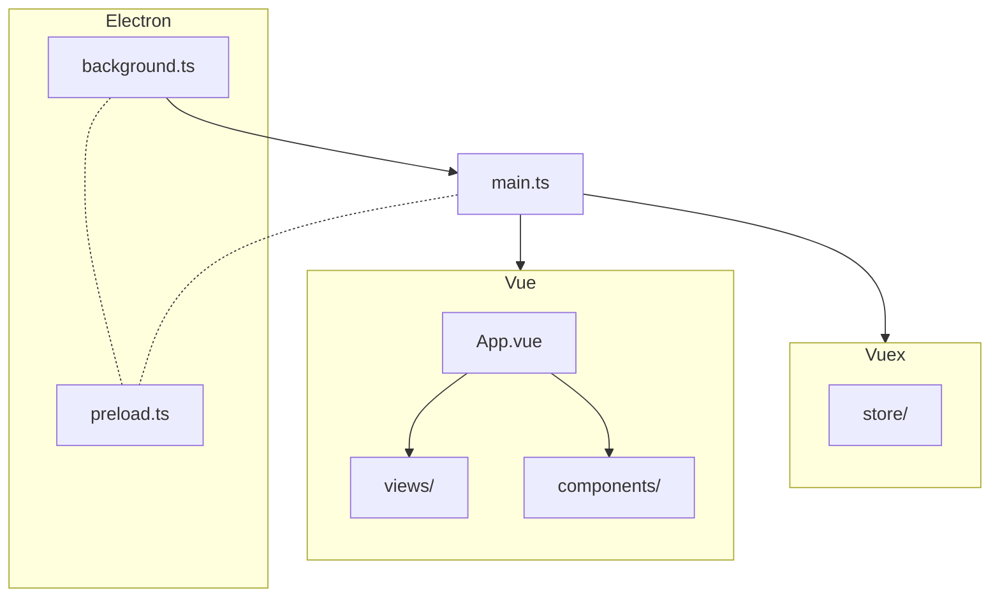

# VOICEVOX エディタのコードの歩き方

VOICEVOX のエディタは Electron・TypeScript・Vue・Vuex などが活用されており、全体構成がわかりにくくなっています。
ここではどういう構成になっているのかを紹介します。コードを読む上で参考になれば幸いです。

## コードが実行される順番

とにかくコードを読みたい方向けに、コードが実行される順番を簡潔に説明します。わかりやすさを優先したため正確な表現でない箇所もあることにご注意ください。

1. electron がアプリケーションを起動します。このとき実行されるコードが `src/background.ts` です。
2. `src/background.ts`から UI 表示のためのウィンドウを起動します。このとき実行されるコードが `src/main.ts` です。
3. `main.ts`が Vue を使って UI がレンダリングされます。UI のルートコンポーネントが `src/App.vue` です。
4. `src/App.vue`が様々な UI を呼び出します。`src/views`や`src/components`にそれぞれの UI があります。
5. UI のレンダリングと同時に、アプリの状態やロジックを管理する Vuex のストアが初期化されます。`src/store`ディレクトリに Vuex 用のコードがあります。
6. これらのコードは全て TypeScript で書かれています。Vue や TypeScript のコードは実行・ビルド時に自動的に JavaScript へトランスパイルされます。

また electron は、最初に起動するプロセス（メインプロセス）と UI ウィンドウ用のプロセス（レンダラープロセス）で通信するために、プリロードスクリプト`src/electron/preload.ts`を両方から読み込みます。

## ソースコードのディレクトリ構成

- src
  - background.ts ･･･ 最初に実行されるコード。ウィンドウを表示したり、エンジンを起動したりする。Electron のメインプロセス。
  - main.ts ･･･ ウィンドウを表示するために最初に実行されるコード。ここで Vue や Vuex を組み込む。
  - App.vue ･･･ Vue のルートになるコンポーネント。他の全てのコンポーネントの親。
  - views ディレクトリ ･･･ 画面全体を覆うような Vue コンポーネントのディレクトリ。
  - components ディレクトリ ･･･ UI のパーツになる Vue コンポーネントディレクトリ。
  - store ディレクトリ ･･･ Vuex のストアのディレクトリ。アプリのロジックの大半はここに書かれる。
  - electron ディレクトリ ･･･ Electron の ipc 通信などのコードが置かれるディレクトリ。
  - type ディレクトリ ･･･ TypeScript 用の型定義などが入るディレクトリ。
  - styles ディレクトリ ･･･ CSS や SCSS などのディレクトリ。
  - infrastructures ディレクトリ ･･･ UI 用のコードと UI 以外のコードを跨ぐときに一枚かませたいときのためのコードのディレクトリ。
  - openapi ディレクトリ ･･･ エンジンの API を叩くためのコードのディレクトリ。OpenAPI で自動生成される。
  - router ディレクトリ ･･･ Vue Router 用のディレクトリ。
  - helpers ディレクトリ ･･･ 便利な関数を置くディレクトリ。
- public
  - アプリのリソースファイルが置かれるディレクトリ。
- build
  - ビルドに必要なファイルが置かれるディレクトリ。
