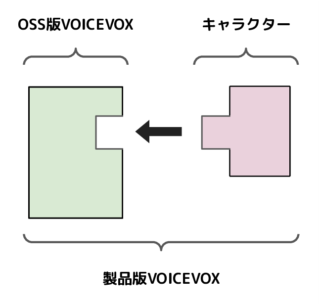
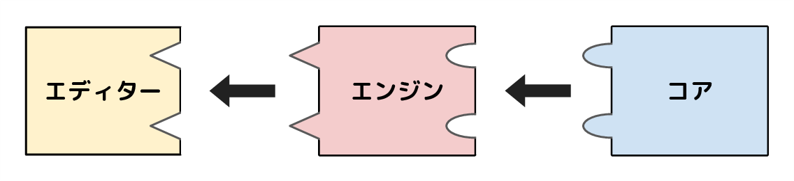

## OSS 版と製品版の違い

オープンソースとして公開されている VOICEVOX（OSS 版 VOICEVOX）と、
[ホームページ](https://voicevox.hiroshiba.jp/)で製品として公開されている VOICEVOX（製品版 VOICEVOX）の違いを紹介します。

一言でいうと、キャラクターが含まれているか、含まれていないかです。
キャラクターは多くの場合 OSS と相反するライセンスを持っているため、OSS にすることができません。
例えば、キャラクターのライセンスによくある「公序良俗に反する利用の禁止」や「反社会的勢力の排除」は、オープンソースの定義の１つである「利用する分野に対する差別の禁止」と衝突します。

The Open Source Definition  
https://opensource.org/osd

そのため VOICEVOX では、キャラクターの要素（声や見た目）を含まない OSS 版と、OSS 版をもとに構築してキャラクターの要素を含めた製品版を分けて開発・配布しています。

## 構成

VOICEVOX は役割に応じた 3 つのモジュール「エディター」「エンジン」「コア」で構成されています。VOICEVOX ソフトウェアはこの 3 つのモジュールを組み合わせて構成されていて、エディターはエンジンを参照し、エンジンはコアを参照しています。

- エディター
  - GUI を表示するためのモジュールで、アプリケーションの形で提供しています
  - TypeScript や Electron や Vue で構成されています
  - リポジトリは [voicevox](https://github.com/VOICEVOX/voicevox) です
- エンジン
  - テキスト音声合成 API を公開するためのモジュールで、Web サーバーの形で提供しています
  - Python や FastAPI や OpenJTalk で構成されています
  - リポジトリは [voicevox_engine](https://github.com/VOICEVOX/voicevox_engine) です
- コア
  - 音声合成に必要な計算を実行するためのモジュールで、動的ライブラリの形で提供しています
  - C++ や onnxruntime で構成されています
  - リポジトリは [voicevox_core](https://github.com/VOICEVOX/voicevox_core) です

## モジュールの独立性

前述の 3 つのモジュール「エディター」「エンジン」「コア」はそれぞれを独立して提供されているので、
一部を VOICEVOX 以外のアプリケーションでも利用できるようになっています。
例えば VOICEVOX のエンジンは Web サーバーの形で提供されているので、
Web リクエストを送信すればテキスト音声合成された結果が得られます。
また、コアは動的ライブラリなので、ソフトウェアに直接組み込むことも可能です。

詳しくは各モジュールのドキュメントをご参照ください。
