# 使い方

## はじめに

これはテキスト音声合成ソフトウェア「VOICEVOX」の使い方を紹介するドキュメントです。  
最初に[利用規約](https://voicevox.hiroshiba.jp/term)をご確認ください。

また、[使い方を軽めに紹介した動画](https://youtu.be/4yVpklclxwU)もあるので、よかったらご覧ください。

## インストール・起動方法

### Windows 版

<details><summary>クリックで展開</summary>

起動しようとすると「Windows によって PC が保護されました」というダイアログが表示されるかもしれません。その際は「詳細情報」をクリックし、発行元が「Kazuyuki Hiroshiba」であることを確認してから「実行」を選んでください。

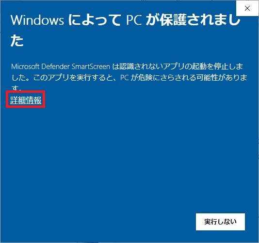 → 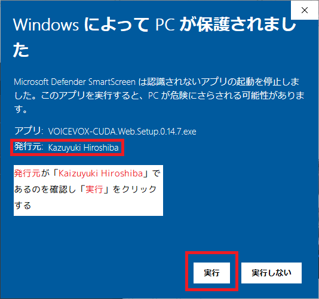

</details>

### Mac 版

<details><summary>クリックで展開</summary>

初回起動時は Apple に登録されていないアプリケーションとして警告ダイアログが表示されるかもしれません。

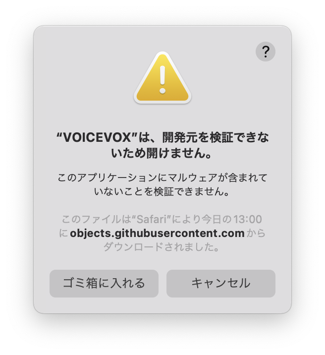

その際は Finder で `Ctrl` キーを押しながら VOICEVOX アプリケーションアイコンをクリックし、ショートカットメニューから「開く」を選択してから、「開く」をクリックしてください。

もしくは、アップルメニューから「システム設定」を選択して「プライバシーとセキュリティ」 をクリックし、ページの下にあるセキュリティの「このまま開く」を選んでください。

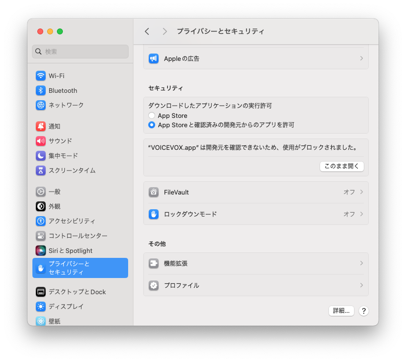

macOS Ventura 以前をお使いの場合は、アップルメニューから「システム環境設定」を選択して「セキュリティとプライバシー」 をクリックし、「一般」パネルで「このまま開く」選んでください。

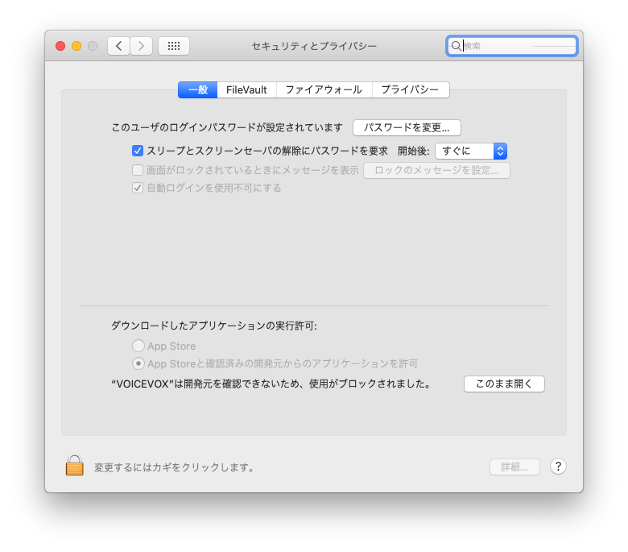

#### Apple Silicon 搭載の Mac をお使いの場合

初めて VOICEVOX を起動する際に Rosetta のインストールを促される場合は、案内に従ってインストールしてください。

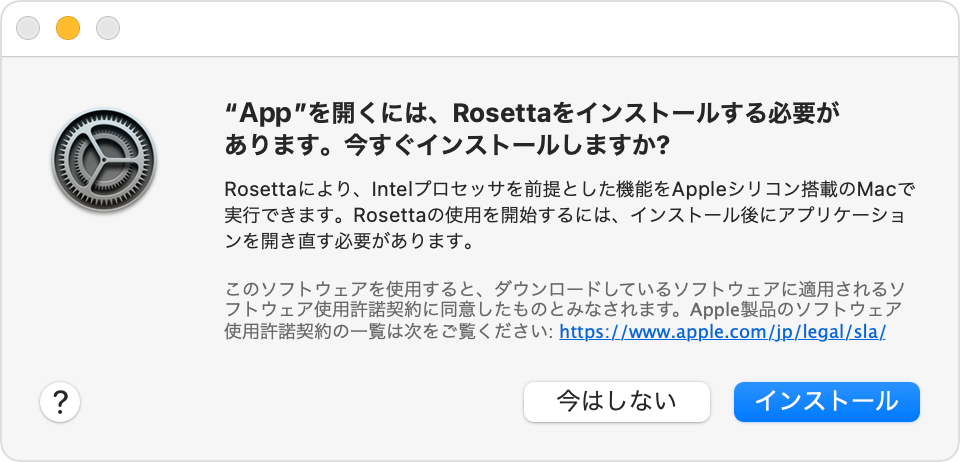

</details>

## 音声合成エンジンの起動

最初に音声合成エンジンが起動します。
GPU をお持ちの方は、音声の生成がずっと速い GPU モードを快適にご利用いただけます。

※Mac 版では GPU モードに対応していないため GPU モードはご利用頂けません。

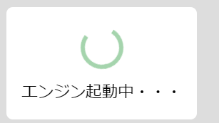

## 音声の生成・再生

キャラクターアイコンの右にある空白をクリックしてテキストを入力してみてください。

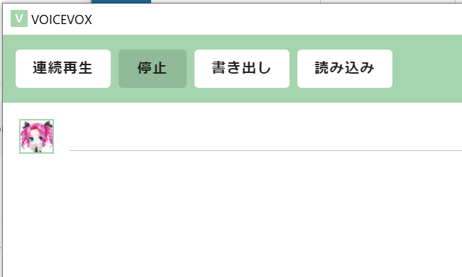

`Enter` キーを押して文章を確定すると、画面の下の方に読みとアクセントが表示されます。（１回目は反映まで数秒ほど時間がかかることがあります。）

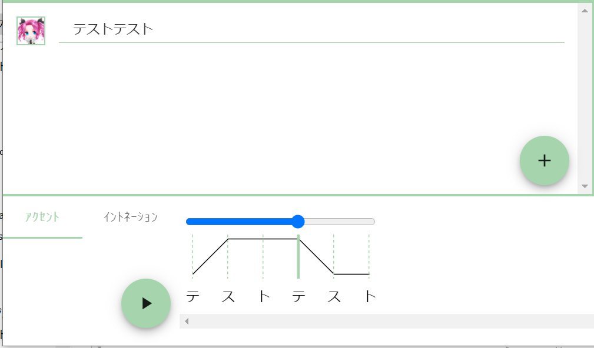

再生ボタンを押すと音声が生成され、音声が再生されます。

## 文章の追加・削除

右下の＋ボタンを押すとテキスト欄が増え、複数の文章を並べることができます。

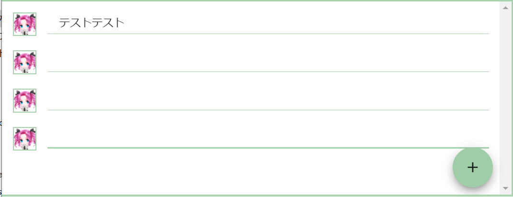

テキスト欄にマウスカーソルを合わせると出てくるゴミ箱のボタンで、そのテキスト欄を削除できます。

## キャラクターの変更

テキスト入力欄の左にあるアイコンをクリックすると、テキストを読み上げてくれるキャラクターを変更することができます。

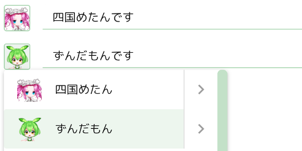

キャラクターの表示順序は「キャラクター並び替え」で変更できます。

## テキスト欄の並び替え

テキスト欄周辺をドラッグすることで、テキスト欄の順番を並び替えられます。

## 単語の接続変更

意図しない箇所で単語が分離していた場合や、意図しない形で結合してしまっている場合は、アクセント項目で文字の間をクリックすることで修正できます。

例えば「ディープラーニング」がこのように分かれてしまった場合は、

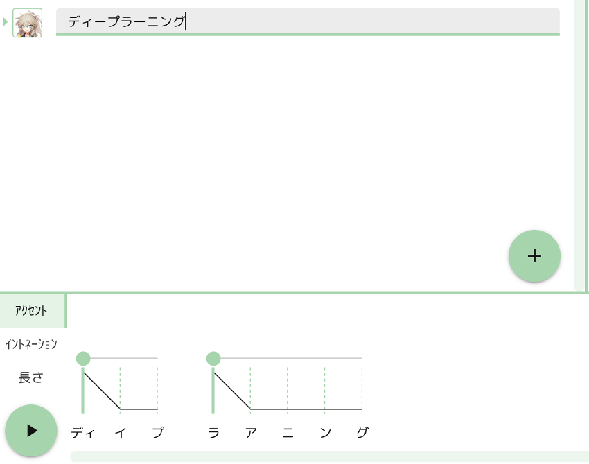

２つの隙間をクリックすると

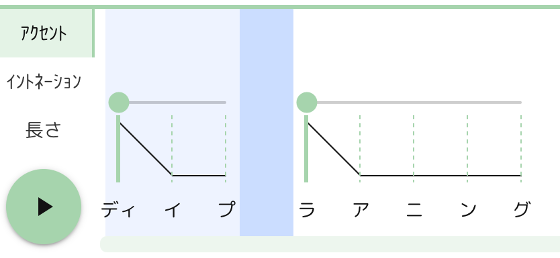

このように１語にまとめることができます

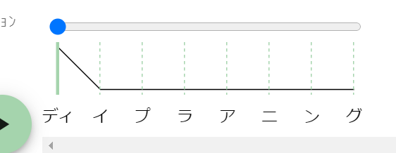

逆に切り離したい場合は、文字の間をクリックして切り離すことができます。

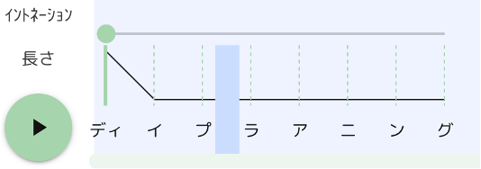

## アクセントの変更

音声の抑揚が意図しないものだった場合に、抑揚を変える方法が２つあります。まずはアクセント箇所を変えてみることをおすすめします。

アクセント箇所を変えるには、読みの上にあるバーを左右に動かします。
例えば「ディープラーニング」を「↑ ディープラ ↓ アニング」と読んでほしい場合は、「ラ」の位置まで丸をスライドします。

 → 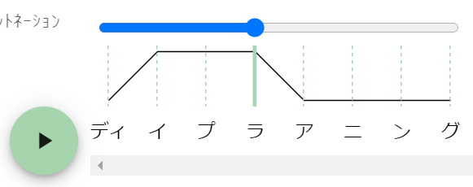

## パラメータの変更

画面の右の欄で、テキスト欄ごとに話速や抑揚などのパラメータを変更することができます。

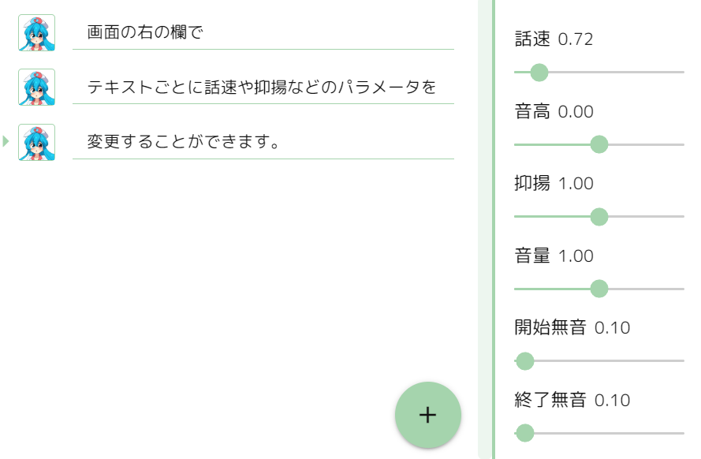

- 話速
  - 読み上げ速度を変更できます。数値が大きいほど速くなります。
- 音高
  - 読み上げの高さを変更できます。数値が大きいほど高くなります。
- 抑揚
  - 読み上げの抑揚を変更できます。数値が小さいほど棒読みに近くなります。
- 音量
  - 音声の音量を変更できます。数値が大きいほど音が大きくなります。
- 間の長さ
  - 文中の無音の長さを変更できます。数値が大きいほど無音時間が長くなります。
- 開始無音・終了無音
  - 音声の先頭や末尾の無音の長さを変更できます。数値が大きいほど無音時間が長くなります。

## イントネーションの変更

アクセントを変更してもうまく行かなかったときや、抑揚をより拘りたいときに、文字ごとの音の高さ（イントネーション）を直接変更することができます。

「イントネーション」をクリックして現れる縦線のバーを上下させることで抑揚を表現できます。

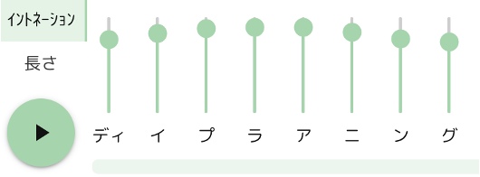

イントネーション調整スペースを縦に広くすることで、より細かく抑揚を調整することもできます。

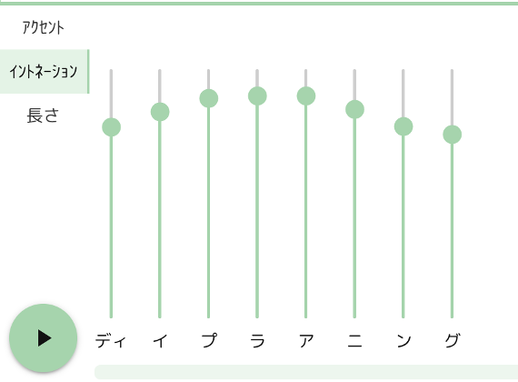

マウスホイールで調整することもできます。Ctrl キー（Mac 版では Command キー）を押しながらマウスホイールを使うと更に細かく調整できます。Alt キー（Mac 版では Option キー）を押しながらイントネーションや長さを調整することで、同じアクセント区間内を同時に調整できます。

また、「キ」や「ツ」や「ス」などが無声化されている場合、バーが灰色になっています。イントネーション欄のテキストをクリックすることで無声化を解くことができます。

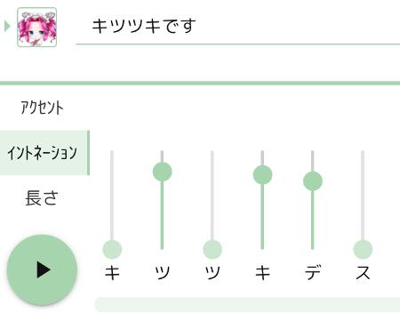 → 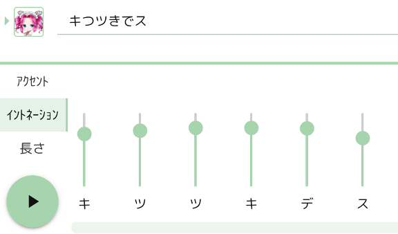

無声化できるものはイ行とウ行だけです。

## 読みの修正

読みが思っているものと違う場合は、アクセント欄で読みをクリックすることで後から修正することもできます。テキスト欄と同様に、ひらがなや句読点、漢字も入力できます。

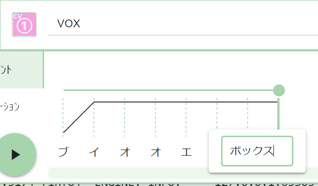

修正箇所以外の調整結果はそのままなので、調整結果を維持したままテキストを修正したいときにも便利です。

## スタイルの変更

キャラクターによっては複数のスタイル（喋り方）を変えることができます。キャラクターの変更と同様に、テキスト欄左のアイコンから選択できます。

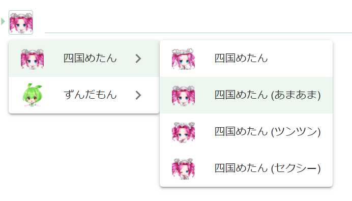

キャラクターを選択したときに適用されるスタイルは、設定の「デフォルトスタイル」で変更できます。

## 音の長さの変更

文字ごとに、音の長さを変えることが可能です。語尾を少し伸ばしたい、無音の長さを調整したいときなどに便利です。

「長さ」をクリックして現れる縦線のバーを上げるとその音を長く、下げると短くできます。
右のバーが母音、左のバーが子音に対応しています。

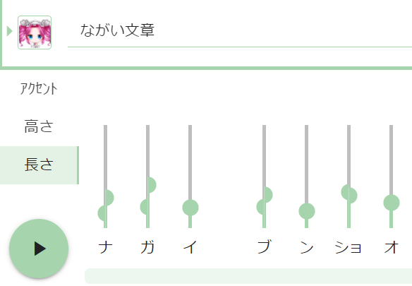

## 音声を途中から再生

アクセント区間をクリックすることで、その区間から音声を再生できます。もう一度クリックすると解除できます。

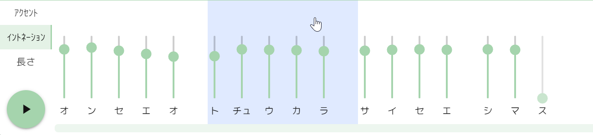

## 音声ファイルの書き出し

メニューにある「ファイル」の「音声書き出し」ボタンを押すと、全テキスト欄の音声が WAV ファイルとして書き出されます。
ファイル保存時、ファイル名は `[何行目]_[キャラ名]_[テキスト冒頭].wav` として保存されます。設定でテキストファイルも一緒に書き出すこともできます。ファイル名は設定の「書き出しファイル名パターン」で変更できます。

## テキストファイルの読み込み

読み込みボタンを押すとテキストファイルを読み込めます。テキストは改行または半角コンマ（,）で区切ることで分割できます。また、キャラクター名だけで区切ることで、そのキャラクターとして読み込むことができます。

例えばこのようなテキストを読み込むと、

```txt
四国めたん,おはようございます,こんにちは
ずんだもん,こんばんは
四国めたん（あまあま）,さようなら
```

このように読み込まれます。

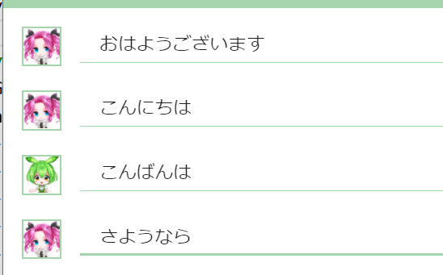

スタイル名が指定されていない場合は、デフォルトスタイルのスタイルが適用されます。

## テキストを繋げて書き出し

メニュー「ファイル」の「テキストを繋げて書き出し」ボタンで、すべてのテキストを書き出すことができます。
テキストはキャラクター名も一緒に保存され、上の「テキストファイルの読み込み」で読み込むこともできます

## プロジェクトファイルの保存・読み込み

入力したテキストやキャラクター、アクセント修正やイントネーションの調整結果は、プロジェクトファイルとして保存し、ソフトウェアを起動し直した後で読み込むことができます。プロジェクトファイルの拡張子は`.vvproj`です。

## ショートカットキー

「設定」の「キー割り当て」でショートカットキーを表示・変更することができます。
（Mac 版をご利用の場合は Ctrl を Command に、Alt を Option に読み替えてください。）

- 上下キー
  - 上下のテキスト欄に移動
- `Space`
  - 音声を再生
- `Shift` + `Enter`
  - テキスト欄を追加
- `Shift` + `Delete`
  - テキスト欄を消去
- `Ctrl` + `S`
  - プロジェクトの保存
- `Ctrl` + `E`
  - 音声を書き出し
- `Ctrl` + `Z`
  - 元に戻す
- `Ctrl` + `Y`
  - やり直す
- `Esc`
  - テキスト欄からカーソルを外す
- 1
  - アクセント欄を表示
- 2
  - イントネーション欄を表示
- 3
  - 長さ欄を表示
- スライダーの上でマウスホイール
  - スライダーの値を変更します（スライダー →）
  - `Ctrl` キーを押しながらマウスホイールを使うと更に細かく調整できます
  - `Alt` キーを押しながらイントネーションや長さを調整することで、同じアクセント区間内を同時に調整できます
- `Ctrl` + `G`
  - 全体のイントネーションをリセット
- `R`
  - 選択中のイントネーションをリセット
- `Ctrl` + 数字
  - 数字番目のキャラクターを選択

## ツールバーのカスタマイズ

ボタンをドラッグすることにより、画面上部にあるツールバーのボタンの種類や配置を変更することができます。

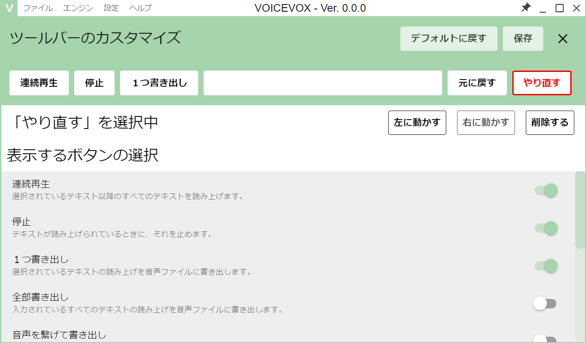

## キャラクターの並び替え・試聴

「設定」の「キャラクターの並び替え」で、キャラクターの表示順序を変更することができます。
また、キャラクターごとのサンプルボイスを試聴することもできます。

## デフォルトスタイル

「設定」の「デフォルトスタイル」で、キャラクターごとのデフォルトのスタイルを変更することができます。

## 読み方＆アクセント辞書

難しい単語や新しい単語は正しい読みにならないことがありますが、辞書機能を使って読み方を登録しておくことができます。
辞書機能は「設定」の「読み方＆アクセント辞書」で利用できます。

読み方＆アクセント辞書画面を開くと、左に登録した単語のリストが表示されます。
「追加」ボタンで新規に単語を登録できます。

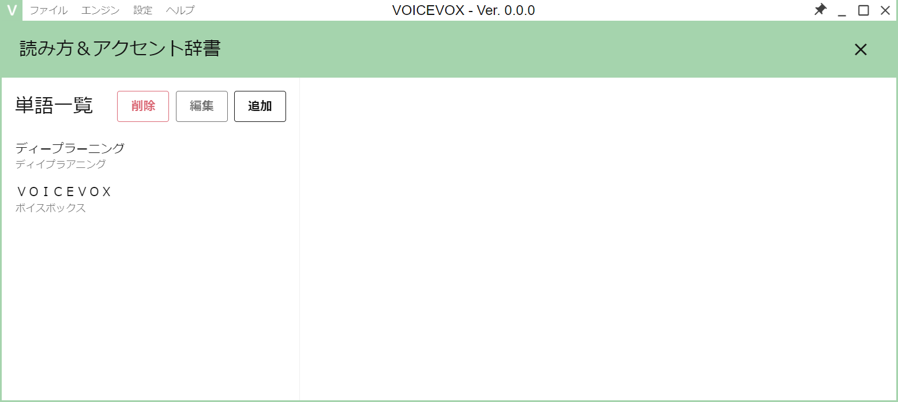

「単語」に登録したいテキストを、「読み」にそのテキストの読み方をひらがなかカタカナで入力してください。
「アクセント調整」で自然になるアクセントを登録できます。
もし登録した単語が反映されない場合は、「単語優先度」を上げてみてください。

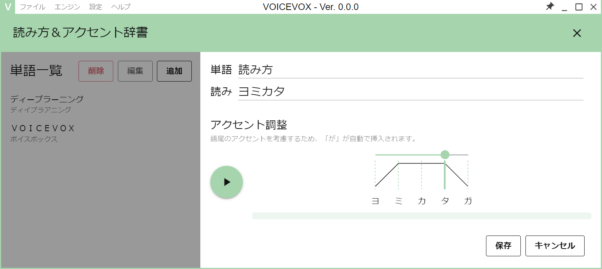

<!--
TODO: 右クリックメニューの説明。項目が増えてきたら追加する。
-->

## ソング機能

VOICEVOX では、歌声合成機能がプロトタイプ版として提供されています。
歌声合成手法は技術的に異なる２つの種類をご用意しています。

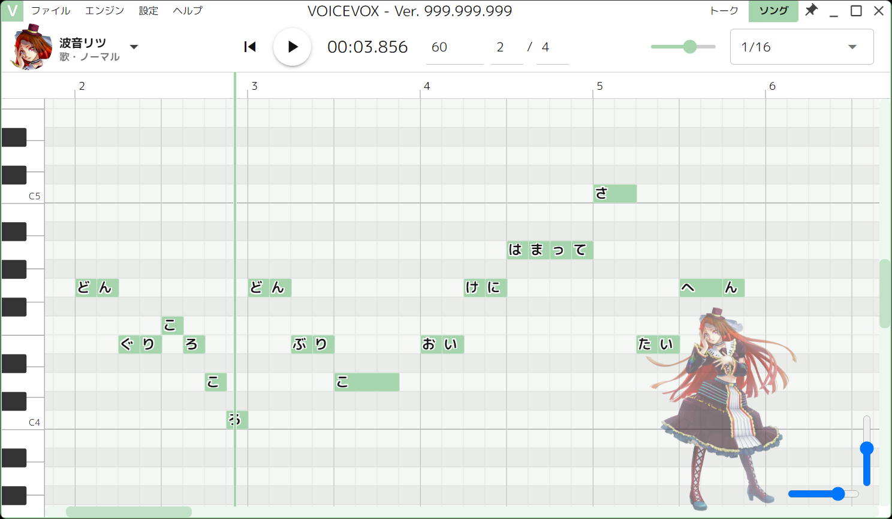

- ハミング：キャラクターの喋り声に近い声で歌うことができます
- ソング：歌声らしい声で歌うことができます

ソング機能は鋭意制作中です。フィードバックをお待ちしています。

### ノート（音符）の追加

ピアノロールをクリックすることで、その高さのノート（音符）を追加できます。
ドラッグすることで、長さを指定しつつノートを追加することもできます。
`Esc`キーでノートの選択状態を解除できます。

### 歌詞の入力

ノートをダブルクリックすることで歌詞を入力できます。複数の文字を入力すれば一括入力できます。

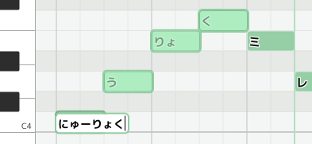

### 音域調整

「音域調整」の値が大きいほど高い音域で、小さいほど低い音域でうまく歌えるようになります。
デフォルトではキャラクターに合う音域が設定されています。

「音域調整」の値と中央のキーの関係はおおよそ以下の通りです。

| 音域調整の値 | 中央のキー |
| ------------ | ---------- |
| 0            | G4（ソ4）  |
| -7           | C4（ド4）  |
| -12          | G3（ソ3）  |
| -19          | C3（ド3）  |
| -24          | G2（ソ2）  |

### 声量調整

デフォルトの設定だと、キャラクターによっては声が少しかすれてしまうことがあります。
そのような場合は「声量調整」を`5`や`10`などにすることで、発声をより強くすることができます。

将来的にこの値は自動設定される予定です。

### ピッチ編集

ツールバーからピッチ編集モードに切り替えることで、歌の音程を細かく制御することができます。

### インポート

様々な形式のプロジェクトファイルをインポートすることができます。

### マルチトラック

画面左上のハンバーガーメニュー ☰ をクリックすることでトラック一覧を表示できます。トラック一覧の＋ボタンでトラックを追加することで、複数のトラックを編集・再生できるようになります。

### ソング機能のよくある質問

Q. 赤くなって声が再生されない  
A. なにかしらのエラー状態を示しています。現在のバージョンでは、１つのノート（音符）につき日本語１文字分のみ入力できます。またノートが重なっていてもエラーとなります。

Q. 思った高さの音が出ない  
A. 音域がずれている可能性があります。「音域調整」で調整してみてください。

## オプション

「設定」の「オプション」でいろいろな設定を変更することができます。

### 「エンジン」項目

エンジンの起動モードの起動モードを変更できます。

GPU モードを利用するには、GPU が必要です。
Linux は Nvidia 製 GPU のみに対応しています。

#### 音声のサンプリングレート

音声のサンプリングレートを変更して再生・保存します。  
サンプリングレートを高くしても音声の品質は上がりません。

### 「操作」項目

#### プリセット機能

話速や抑揚などのパラメータをまとめて登録できるプリセット機能を利用できるようになります。ソフトウェアが終了しても設定したプリセットは残ります。  
プリセットを再登録する際、同じプリセットを割り当てているテキスト欄のパラメータを一括で変更することもできます。

スタイルごとに１つデフォルトプリセットが用意されています。

#### スタイル変更時にデフォルトプリセットを適用

プリセット機能をオンにしている場合、スタイルを変更したときにデフォルトプリセットを自動的に適用するようになります。

#### パラメータの引き継ぎ

テキスト欄を追加する際、話速や抑揚といったパラメータを引き継ぐようになります。

#### 再生位置を追従

再生中の単語が画面内に収まるよう、自動的にスクロールして追従するようになります。

#### テキスト自動分割

テキストを貼り付ける時、句点や改行でテキストを分割するかの挙動を変更できます。

#### メモ機能

テキストを`[]`で囲むことで、テキスト中にメモを書けます。半角の`[]`と全角の`［］`のどちらにも対応しています。

#### ルビ機能

テキストに`{ルビ対象|よみかた}`と書くことでテキストの読み方を変えられるようになります。半角の`{|}`と全角の`｛｜｝`のどちらにも対応しています。書き出しテキストを変えずに読み方を変えたいときに便利です。

### 「保存」項目

#### 書き出し先を固定

音声ファイルを書き出すフォルダを固定し、毎回フォルダを選択しなくても同じフォルダに書き出し続けるようにします。

#### 書き出しファイル名パターン

音声やテキストファイルなどを書き出す際のファイル名をカスタマイズできます。

#### 上書き防止

同じファイル名のファイルがあった場合に連番として保存します。

#### 文字コード

読み込み・書き込み用の文字コードを選択できます。

#### txt ファイルを書き出し

テキスト内容を一緒に保存します。

#### lab ファイルを書き出し

リップシンクなどに便利な、音声の音素情報とそのタイミング情報が書かれたラベルファイルを一緒に保存します。

### 「外観」項目

#### テーマ

デフォルトのライトテーマと、暗めのダークテーマを切り替えることが出来ます。

#### フォント

ソフトウェアで使用するフォントを変更できます。

#### 行番号の表示

テキスト欄の左に行番号を表示します。

#### テキスト追加ボタンの表示

テキスト追加ボタンを非表示にできます。ショートカットキー`Shift`+`Enter`でテキスト欄を追加できます。

### 「高度な設定」項目

#### マルチエンジン機能

VOICEVOX API 準拠エンジンを VOICEVOX 内で利用できるようになります。  
マルチエンジン機能をオンにしたあと、メニューにある「エンジン」の「エンジンの管理」に移動し、次のどちらかを実行すると利用できます。

- VOICEVOX API 準拠エンジンの VVPP ファイルをインストールする
- VOICEVOX 系ソフトウェア内のエンジンのパスを指定する

#### 音声をステレオ化

音声をモノラルからステレオに変換して再生・保存します。

#### 再生デバイス

音声を再生するデバイスを変更できます。

### 「実験的機能」項目

開発中の便利機能を利用することができます。

#### 疑問文自動調整

疑問文のときに自動的に語尾の音を上げて、疑問文っぽい音声を生成するようになります。

#### モーフィング機能

対応している音声を混ぜてモーフィングした音声を合成できるようになります。  
２つの音声を一度生成してから、音声を機械的に分析・再合成する後処理を行うことで実現しています。

#### 複数選択

複数のテキスト欄を選択できるようになります。
`Shift` キーを押しながらクリックすることで、最後に選択したテキスト欄からクリックしたテキスト欄までのすべてのテキスト欄を選択できます。
`Ctrl` キーを押しながらクリックすることで、複数のテキスト欄を個別に選択できます。

### 「データ収集」項目

#### ソフトウェア利用状況のデータ収集を許可する

各 UI の利用率などのデータを送信して VOICEVOX の改善に役立てます。  
入力されたテキストデータや音声データの情報は収集しておりませんのでご安心ください。

## その他

右上のピンボタンでウィンドウを最前面に固定できます。

## ヘルプ

利用規約などを確認することができます。

## アンインストール方法

### Windows 版

インストーラー版でインストールした場合、インストールしたフォルダの中にある`Uninstall VOICEVOX.exe`を実行してください。  
ZIP ファイルを解凍した場合、ダウンロードした ZIP ファイルと、展開したフォルダを消去すればアンインストール完了です。

### Mac 版

インストーラー版でインストールした場合、「アプリケーション」フォルダにある VOICEVOX を「ゴミ箱」にドラッグ＆ドロップしてください。  
ZIP ファイルを解凍した場合、ダウンロードした ZIP ファイルと、展開したフォルダを消去すればアンインストール完了です。

マルチエンジン機能で追加したエンジンを削除する場合は、Finder のメニューバーの「移動」をクリックし、「フォルダへ移動」をクリックして表示された画面に`~/Library/Application Support/voicevox`と入力して `Enter`キーを押し、`vvpp-engines`フォルダを削除すれば完了です。

<!-- TODO: windowsの方にもvvpp-enginesフォルダ削除方法を案内する -->

## よくあるご質問

[Q&A](https://voicevox.hiroshiba.jp/qa) をご参照ください。

## ご感想・ご要望・バグ報告など

ご感想・ご要望は、ぜひ X（旧 Twitter）にてハッシュタグ `#VOICEVOX` を付けてポストしてください。開発の励みになります。

うまく動かない場合や不具合を見つけられた方は、X にて不具合をハッシュタグ `#VOICEVOX` を付けてポストしていただくか、VOICEVOX 公式（[@voicevox_pj](https://x.com/voicevox_pj)）までご報告ください。

その他、 Q&A に掲載されていないご質問があれば VOICEVOX 公式（[@voicevox_pj](https://x.com/voicevox_pj)）にお問い合わせください。
